```{r setup, include=FALSE}
knitr::opts_chunk$set(echo = TRUE)
```

# Prefacio {-}

El FNE (*Fondo Nacional de Estupefacientes*) tiene como objetivo la vigilancia y control sobre la importación, la exportación, la distribución y venta de drogas, medicamentos, materias primas o precursores de control especial, a que se refiere la Ley 30 de 1986 y las demás disposiciones que expida el Ministerio de la Protección Social, así como apoyar a los programas contra la farmacodependencia que adelanta el Gobierno Nacional. 

Aquí va un prefacio emotivo....


<!--chapter:end:index.Rmd-->

# Introducción

Con motivo de presentar la metodología del trabajo territorial que se adelanta en el marco del proyecto de inversión 1901 `Incremento de la disponibilidad de medicamentos Monopolio del Estado para los pacientes en Colombia Nacional Código BPIN 2020011000020` y puesto que uno de los ejes centrales para garantizar la disponibilidad de los medicamentos monopolio del estado (MME) en el territorio nacional, recae en el manejo que le den a los mismos cada una de las entidades encargada en su respectivo departamento, en este documento se plasmará el desarrollo de recolección de información concerniente a los Fondo Rotatorio de Estupefaciente (FRE) de las 5 regiones del país, Andina Norte, Andina Sur, Amazonía, Caribe, Orinoquía y Pacífico.

Este proyecto se diseñó con la finalidad de cumplir con dos objetivos en específico, el primer objetivo es fortalecer el proceso de abastecimiento de medicamentos monopolio del Estado, identificando fuentes de información asociada a la prescripción, dispensación y uso de medicamentos monopolio del Estado, con énfasis en el recetario oficial y generar informes de análisis de los datos reportados por el FRE para el manejo de medicamentos monopolio del Estado que permitan un seguimiento eficaz y oportuno.

El segundo objetivo busca mejorar la cantidad y calidad de la prescripción de medicamentos monopolio del Estado realizando visitas, reuniones, mesas de trabajo e intercambios de experiencias con los FRE del territorio nacional como base para construir herramientas y piezas con información veraz acerca de MME, de manera comprensiva y precisa para diferentes públicos (pacientes, prestadores, otros) con el fin de mejorar conductas y hábitos del estado de salud.

A continuación, se describe toda la información obtenida de los FRE a nivel nacional dividido por las regiones nacionales y descrito en dos componentes. El primero, acerca de los procesos de adquisición, venta, distribución, seguimiento, recepción, consolidación y archivo de recetarios oficiales. Y el segundo, relacionado a las proyecciones de compra, recepción técnica, almacenamiento e inventario de los medicamentos monopolio del estado y sus respectivos anexos reglamentados en las resoluciones 1478 y 1479 de 2006.
 
Este proceso de inmersión territorial se desarrolló entre los meses de abril y agosto de 2021. Los funcionarios de los FRE, atendieron el llamado del Fondo Nacional de Estupefacientes (FNE) con la mejor disposición, brindando información relevante para el proyecto de inversión 1901 y comentando las diferentes vicisitudes que suceden en el territorio. El desarrollo de las reuniones se llevó a cabo de manera exitosa, de forma fluida y cordial.


<!--chapter:end:L001_Introduccion.Rmd-->

# Objetivos

**Objetivo general**

Identificar fuentes de información asociada a la prescripción, dispensación y uso de medicamentos monopolio del Estado, con énfasis en el recetario oficial. Así mismo,  con el fin de iniciar la primera fase de desarrollo del proyecto de inversión 1901. Así mismo, recopilar las características de las herramientas tecnológicas para la consolidación de la información y el seguimiento al consumo de estos medicamentos en el territorio.

**Objetivos específicos**

- Caracterizar el proceso de prescripción, dispensación y uso de MME, identificando la información relacionada con el tipo de prescriptores y requisitos normativos.

- Consolidar la información obtenida a partir de los recetarios oficiales con el fin de que esta sea fuente de información permanente para la parametrización del Recetario Oficial Electrónico (ROE).

- Estandarizar el proceso de proyección de compra de MME por parte de los FRE.

- Caracterizar las condiciones de recepción técnica, almacenamiento, distribución y consumo de los MME en todo el territorio nacional.

- Recopilar la información asociada con la consolidación de la información y seguimiento al consumo de estos medicamentos en cada una de las IPS en el departamento.

- Definir e identificar el proceso mediante el cual se hace el manejo de almacenamiento e inventarios de MME por parte de cada FRE.

- Recopilar las características de las herramientas tecnológicas con las cuales cuentan los FRE para hacer seguimiento a inventarios de MME y para la proyección de necesidades de MME en el departamento.

<!--chapter:end:L002_Objetivos.Rmd-->

# Justificación

Uno de los ejes centrales para garantizar la disponibilidad de los MME en el territorio nacional, recae en el cálculo adecuado de la demanda por estos medicamentos, la cual es determinada por cada ente territorial con base en la demanda de las entidades que tienen inscritas.

Para atender la necesidad de estos medicamentos el Grupo interno de trabajo de medicamentos del Estado, creado mediante la Resolución 735 de 2016, tiene entre sus funciones:

- Coordinar las acciones necesarias para garantizar la disponibilidad y accesibilidad a los medicamentos monopolio del Estado en el territorio colombiano juntamente con los Fondos Rotatorios de Estupefacientes (FRE).

- Preparar y presentar el reporte de los informes de consumo de medicamentos monopolio del Estado desagregado por departamentos y consolidado nacional.

- Mantener el control de las existencias de las materias primas y de los medicamentos monopolio del Estado a nivel nacional, garantizando su disponibilidad permanente.

- Planear y efectuar las acciones de asistencia técnica a los FRE, que permita garantizar la disponibilidad y accesibilidad de los medicamentos monopolio del Estado a nivel nacional.

Sin embargo, la planeación de las cantidades de medicamentos monopolio del Estado para satisfacer la demanda se ve afectada por:

- La variabilidad en el incremento o disminución de la distribución y necesidad de medicamentos monopolio del Estado.

- La participación en las guías de tratamiento farmacológico de cada uno de estos medicamentos y que se ve afectada por las diferentes recomendaciones internacionales.

-  La calidad de la información de disponibilidad remitida por los FRE.

- Las diferentes barreras administrativas de índole territorial que impactan en el acceso de estos medicamentos por parte de los pacientes.

Por lo cual, con el fin de fortalecer los procesos de operativos, administrativos y técnicos encaminados a garantizar la disponibilidad y a fortalecer el acceso a los medicamentos monopolio del Estado en todo el territorio, se formuló el proyecto de inversión *incremento de la disponibilidad de medicamentos monopolio del Estado para los pacientes en Colombia*.

Este proyecto se diseñó con la finalidad de cumplir con dos objetivos en específico, el primer objetivo busca establecer un mecanismo estandarizado y sistematizado para determinar la demanda de materias primas y MME a partir de información completa y suficiente, que además permita aumentar la efectividad en el seguimiento, evaluación, control y consolidación de la información de gestión presentada por los FRE. Para lo cual es necesario mejorar la articulación con las entidades territoriales y con los demás actores que intervienen en el proceso.

El segundo objetivo busca fortalecer los canales de comunicación entre el FNE y las asociaciones médicas, gremios del sector farmacéutico, médicos prescriptores, dispensadores y demás actores que participen en el proceso de prescripción, mediante acciones de socialización, participación en congresos, capacitación a los profesionales de la salud, apoyo a la sociedad de las especialidades y demás actividades encaminadas a fortalecer el uso racional de los medicamentos monopolio del Estado y visibilizar su importancia en la práctica clínica.

El desarrollo de este proyecto se enmarca en una estrategia integral con el fin de contribuir a mejorar la calidad de la atención de los pacientes, garantizando el acceso y disponibilidad a medicamentos de control especial y de Monopolio del Estado, evitando el desvío de estos.

El proyecto comprende el Programa 1901, denominado **salud pública y prestación de servicios** el cual está orientado a las acciones de formulación, adopción, coordinación, ejecución, seguimiento y evaluación de políticas, planes, programas y proyectos del Gobierno Nacional de interés en salud pública y considera, entre otros, los siguientes elementos:

1. Promoción y Prevención de enfermedades: incluye vacunación y la política de atención Integral en Salud.

2. Gestión de promoción social: incluye el acceso a servicios de asistencia y promoción social a poblaciones vulnerables.

3. Gestión de epidemiología y demografía.

4. Gestión de la prestación de servicios: incluye las redes de salud, política nacional de calidad en la infraestructura en salud.

5. Gestión de medicamentos y tecnologías en salud.

El desarrollo de las actividades de este proyecto propende por el fortalecimiento de la articulación con los otros actores relacionados con la cadena de distribución del medicamento, tanto a nivel territorial como a nivel asistencial de tal manera que haya un impacto positivo en:

- Pacientes y usuarios de los servicios de salud.

- Ciudadanos colombianos, los cuales podrán contar con servicios más oportunos y más acceso a las tecnologías en salud.

- Funcionarios del Fondo, por cuanto contarán con capacidades y herramientas que les permitan cumplir sus objetivos y atender con mayor facilidad los posibles inconvenientes que dificulten su cumplimiento.

Por tanto, con el fin de iniciar la primera fase de desarrollo de este proyecto de inversión en el marco del primer objetivo, encaminados a ejecutar la primera actividad Identificar fuentes de información asociada a la prescripción, dispensación y uso de medicamentos monopolio del Estado, con énfasis en el recetario oficial, apoyados por el equipo de Regionalización, que se encuentra orientado al aseguramiento de la disponibilidad, accesibilidad y uso racional de los medicamentos, se hace necesario realizar el acercamiento con el ente territorial de tal manera que se pueda:

- Caracterizar el proceso de prescripción, dispensación y uso de MME, identificando la información relacionada con el tipo de prescriptores, requisitos normativos etc.

- Analizar la información de los recetarios oficiales que reposan en los FRE.

- Recopilar la información asociada a los recetarios oficiales a partir de los recetarios físicos en los FRE.

- Definir e identificar la información asociada con los recetarios oficiales, lo cual será insumo en la parametrización del Recetario Oficial Electrónico (ROE).

- Consolidar la información obtenida a partir de los recetarios oficiales con el fin de que esta sea fuente de información permanente.

Por otro lado, para fortalecer el proceso de estimación de la necesidad de medicamentos monopolio del Estado se hace necesario realizar un acercamiento con el ente territorial de tal manera que se pueda:

- Estandarizar el proceso de proyección de compra de MME por parte de los FRE.

- Caracterizar las condiciones de recepción técnica, almacenamiento, distribución y consumo de los MME en todo el territorio nacional.

- Recopilar la información asociada con la consolidación de la información y seguimiento al consumo de estos medicamentos en cada una de las IPS en el departamento.

- Definir e identificar el proceso mediante el cual se hace el manejo de inventarios de MME por parte del FRE.

- Recopilar las características de las herramientas tecnológicas con las cuales cuentan los FRE para hacer seguimiento a inventarios de MME y para la proyección de necesidades de MME en el departamento.


<!--chapter:end:L003_Justificacion.Rmd-->

# Estructura del FRE

```{r configuracion1-L101, include=FALSE}
require(tidyverse); theme_set(theme_bw())
require(plotly)
require(sf)
require(ggrepel)
require(ggsflabel)
require(patchwork)
require(scatterpie)
require(vistime)

fig_path <- file.path('..', '..', 'figures')

barButtons <- c("zoomIn2d", "zoomOut2d", "lasso2d", "pan2d", 
                                    "select2d", "drawclosedpath", "autoScale2d", "zoom2", 
                                    "toggleSpikelines", "hoverCompareCartesian", "hoverClosestCartesian", 
                                    "resetScale2d")
```

\maxdeadcycles=1000

## Fecha de constitución de FRE

```{r serieTiempoCreacion, echo=FALSE, fig.cap='Serie de tiempo de actas de creación de FRE', fig.topcaption=TRUE,message=FALSE, warning=FALSE, out.width="90%", fig.width=10, fig.height=8, out.width="100%", out.height="20%"}
if (knitr::is_html_output()) {
  readRDS(file.path(fig_path, '001_serieTiempoCreación.rds')) %>% 
    config(modeBarButtonsToRemove = barButtons)
} else {
  readRDS(file.path(fig_path, "002_serieTiempoCreación.rds"))
}
```

## Estructura organizacional

```{r perfilProfesionalEncargado, echo=FALSE, fig.cap='Perfil de profesional de encargados de los FRE', fig.width=6, fig.height=4, fig.topcaption=TRUE, out.width="85%"}
readRDS(file.path(fig_path, '020_perfilProfesionalEncargado.rds')) + labs(title = NULL)
```

```{r perfilProfesionalDepartamentos1, echo=FALSE, fig.cap='Perfil de profesional de encargados de los FRE por departamento', fig.width=8, fig.height=6,fig.topcaption=TRUE, out.width="85%"}
readRDS(file.path(fig_path, '021_mapaProfesional.rds')) + labs(title = NULL)
```

```{r perfilProfesional2, echo=FALSE, fig.cap='Perfil de profesional de personal de apoyo a los FRE', fig.width=8, fig.height=6, fig.topcaption=TRUE, out.width="90%"}
readRDS(file.path(fig_path, '022_perfilProfesional2.rds')) + labs(title = NULL)
```

```{r perfilProfesional3, echo=FALSE, fig.cap='N.° de personas que trabajan en el FRE', fig.width=6, fig.height=4, fig.topcaption=TRUE, out.width="85%"}
readRDS(file.path(fig_path, '023_perfilProfesional3b.rds')) + labs(title = NULL)
```

```{r mapaProfesional2, echo=FALSE, fig.cap='N.° de personas que trabajan en el FRE por departamento', fig.width=8, fig.height=6, fig.topcaption=TRUE, out.width="85%"}
readRDS(file.path(fig_path, '024_mapaProfesional2.rds')) + labs(title = NULL)
```

```{r pieProfesional2, echo=FALSE, fig.cap='Tipo de vinculación al FRE', fig.width=5, fig.height=5, fig.topcaption=TRUE, out.width="85%"}

if (knitr::is_html_output()) {
  readRDS(file.path(fig_path, '026_pieProfesional2b.rds'))
} else {
  readRDS(file.path(fig_path, '026_pieProfesional1b.rds'))
}
```

## Instituciones inscritas en el FRE

```{r institucionesInscritas, echo=FALSE, fig.cap='N° de instituciones inscritas en el departamento', fig.width=6, fig.height=4, out.width="75%", fig.topcaption=TRUE, message=FALSE, warning=FALSE, out.width="90%"}
readRDS(file.path(fig_path, "099_NEntidadesCompradoras.rds")) + 
  labs(title = NULL)
```

```{r institucionesInscritasRelacion, echo=FALSE, fig.cap='Relación entre N° de instituciones inscritas y personal del FRE', fig.width=6, fig.height=4, out.width="85%", fig.topcaption=TRUE, message=FALSE, warning=FALSE}
readRDS(file.path(fig_path, "100_RelacionRecursosFRE.rds")) + 
  labs(title = NULL)
```

## Caracterización de las fuentes de ingresos de los FRE
```{r IngresosFRE1, echo=FALSE, warning=FALSE, fig.cap='Proporción de fuentes de ingresos de los FRE', fig.width=8, fig.height=6, fig.topcaption=TRUE, out.width="85%", message=FALSE}
  readRDS(file.path(fig_path, "135_IngresosFRE1.rds")) + labs(title = NULL)
```
```{r IngresosFRE2, echo=FALSE, warning=FALSE, fig.cap='Mapa con fuentes de ingresos de los FRE', fig.width=8, fig.height=6, fig.topcaption=TRUE, out.width="85%", message=FALSE}
readRDS(file.path(fig_path, "136_IngresosFRE2.rds")) +labs(title = NULL)
```


```{r CaracterizacionIngreso1, echo=FALSE, warning=FALSE, tab.cap='Proporción de personas contratadas por región'}
data.frame(
  stringsAsFactors = FALSE,
            Región = c("Amazonía","Caribe","Central",
                       "Eje Cafetero","Orinoquía","Pacífico"),
      Nombramiento = c("21.43%","42.86%","41.38%",
                       "58.33%","45.45%","19.23%"),
      Contratación = c("78.57%","57.14%","58.62%",
                       "41.67%","54.55%","80.77%")
) -> dfSF

dfSF %>% 
  knitr::kable(booktabs = TRUE, caption = 'Proporción de personas contratadas por región')
```


<!--chapter:end:L101_EstructuraFRE.Rmd-->

---
output:
  pdf_document: default
  html_document: default
---

# Recetarios oficiales

```{r configuracion1-L102, include=FALSE}
require(tidyverse); theme_set(theme_bw())
require(plotly)
require(sf)
require(ggrepel)
require(ggsflabel)
require(patchwork)
require(scatterpie)
require(vistime)

fig_path <- file.path('..', '..', 'figures')

barButtons <- c("zoomIn2d", "zoomOut2d", "lasso2d", "pan2d", 
                                    "select2d", "drawclosedpath", "autoScale2d", "zoom2", 
                                    "toggleSpikelines", "hoverCompareCartesian", "hoverClosestCartesian", 
                                    "resetScale2d")
```

\maxdeadcycles=1000

## Existencia de recetarios


```{r existenciasRecetarios, echo=FALSE, fig.cap='N.° de existencias de recetarios en el FRE', fig.width=8, fig.height=6, fig.topcaption=TRUE, out.width="85%"}
readRDS(file.path(fig_path, '027_existenciaRecetarios_1.rds')) + 
  labs(title = NULL)
```

```{r existenciasRecetarios2, echo=FALSE, fig.cap='N.° de recetarios circulantes en el departamento', fig.width=7, fig.height=5, fig.topcaption=TRUE, out.width="85%"}
readRDS(file.path(fig_path, '028_existenciaRecetarios_2.rds')) + 
  labs(title = NULL)
```

```{r existenciaRecetarios3, echo=FALSE, fig.cap='Duración de existencia de recetarios en el FRE', fig.width=7, fig.height=5, fig.topcaption=TRUE, out.width="85%"}
readRDS(file.path(fig_path, '029_existenciaRecetarios_3.rds')) + 
  labs(title = NULL)
```

```{r existenciaRecetarios4, echo=FALSE, fig.cap='N.° de prescripciones por recetario', fig.width=6, fig.height=4, fig.topcaption=TRUE, out.width="85%"}
readRDS(file.path(fig_path, '030_existenciaRecetarios_4.rds')) + 
  labs(title = NULL)
```

## Costos de recetarios

```{r costoRecetario, echo=FALSE, fig.cap='Comparativo de costo vs precio de recetarios por departamento', fig.width=6, fig.height=4, fig.topcaption=TRUE, out.width="90%"}
readRDS(file.path(fig_path, '031_costoRecetario.rds')) + 
  labs(title = NULL)
```


<!-- ```{r comparativoDepartamentos, echo=FALSE, warning=FALSE, fig.cap='Comparativo de costo vs precio y márgen de beneficio', fig.width=8, fig.height=6, fig.topcaption=TRUE, out.width="90%"} -->
<!-- readRDS(file.path(fig_path, '032_comparativoDepartamentos.rds')) + labs(title = NULL) -->
<!-- ``` -->

```{r comparativoDepartamentos0, echo=FALSE, warning=FALSE, fig.cap='Márgen de ganancia por recetario', fig.width=8, fig.height=6, fig.topcaption=TRUE, out.width="90%"}
readRDS(file.path(fig_path, '032b_comparativoDepartamentos.rds')) + labs(title = NULL)
```
```{r comparativoDepartamentos1, echo=FALSE, warning=FALSE, fig.cap='Mapa de márgenes de ganancia por recetario', fig.width=8, fig.height=6, fig.topcaption=TRUE, out.width="90%"}
g1 <- readRDS(file.path(fig_path, '032c_comparativoDepartamentos.rds'))
g1[[1]] + labs(title = NULL)
```

```{r comparativoDepartamentos2, echo=FALSE, warning=FALSE, fig.cap='Comparativo de costo vs precio y márgen de beneficio (2)', fig.width=8, fig.height=4, fig.topcaption=TRUE}
readRDS(file.path(fig_path, '033_comparativoDepartamentos1.rds')) + 
  labs(title = NULL)
```

```{r PVTA-Recetarios, echo=FALSE, warning=FALSE, fig.cap='Precio de venta de recetario por prescripción', fig.width=9, fig.height=5, fig.topcaption=TRUE, out.width="90%"}
readRDS(file.path(fig_path, '034_PVTA_recetarios_prescripcion.rds')) + 
  labs(title = NULL)
```

```{r DependParcial1, echo=FALSE, warning=FALSE, fig.cap='Gráficos de dependencia parcia - Modelo de Costos', fig.width=9, fig.height=5, fig.topcaption=TRUE, out.width="90%"}
readRDS(file.path(fig_path, '046c_GraficasDependenParcial.rds')) + plot_annotation(title = NULL)
```

## Tiempos de adquisición de recetarios

```{r modalidadAdquisicion, echo=FALSE, warning=FALSE, fig.cap='Modalidad de selección para contratos de adquisición de recetarios', fig.width=7, fig.height=4, fig.topcaption=TRUE, out.width="85%"}
readRDS(file.path(fig_path, '035_modalidadAdquisicion.rds')) + 
  labs(title = NULL)
```

```{r tiempoDemoraAdquisicion, echo=FALSE, warning=FALSE, fig.cap='Tiempo de demora para adquisición de recetarios', fig.width=7, fig.height=5, fig.topcaption=TRUE, out.width="85%"}
readRDS(file.path(fig_path, '036_demoraRecetario.rds')) + 
  labs(title = NULL)
```

```{r BD-diligBDRecet, echo=FALSE, warning=FALSE, fig.cap='Proporción de FRE que diligencian campos en BD de venta de recetarios', fig.width=7, fig.height=4, fig.topcaption=TRUE, out.width="85%"}
readRDS(file.path(fig_path, "041_BD_diligBDRecet.rds")) + 
  labs(title = NULL)
```

```{r SeguimientoUsoRecetarios, echo=FALSE, warning=FALSE, fig.cap='Actividades realizadas por el FRE para el seguimiento del uso de recetarios', fig.width=8, fig.height=5, fig.topcaption=TRUE, out.width="85%"}
readRDS(file.path(fig_path, "043_SeguimientoUsoRecetarios.rds")) + 
  labs(title = NULL)
```

## Tiempos de despacho de recetarios
```{r MedidasSeguridadRec, echo=FALSE, warning=FALSE, fig.cap='Medidas de seguridad en los recetarios', fig.width=7, fig.height=5, fig.topcaption=TRUE, out.width="90%"}
readRDS(file.path(fig_path, "045_MedidasSeguridadRec.rds")) + 
  labs(title = NULL)
```

```{r ComparativoCostosRec, echo=FALSE, warning=FALSE, fig.cap='Comparativo de márgen de ganancia de recetarios', fig.width=10, fig.height=5, fig.topcaption=TRUE, message=FALSE, out.width="90%"}
readRDS(file.path(fig_path, "046_ComparativoCostosRecetarios.rds")) + labs(title = NULL)
```

```{r ReciboRecetariosInstituciones, echo=FALSE, warning=FALSE, fig.cap='Recibo de recetarios de instituciones inscritas', fig.width=6, fig.height=5, fig.topcaption=TRUE, out.width="85%"}
readRDS(file.path(fig_path, "047_ReciboRecetarios.rds")) + labs(title = NULL)
```

```{r TiempoRecepcionRecOficiales, echo=FALSE, warning=FALSE, fig.cap='Tiempo de recepción de recetarios oficiales desde IPS', fig.width=7, fig.height=5, fig.topcaption=TRUE, out.width="85%"}
readRDS(file.path(fig_path, "048_ReciboRecetariosIPS.rds")) + labs(title = NULL)
```

```{r TiempoArchivoRecetariosOficiales, echo=FALSE, warning=FALSE, fig.cap='Tiempo de archivo de los recetarios oficiales en los FRE', fig.width=7, fig.height=5, fig.topcaption=TRUE, out.width="85%"}
readRDS(file.path(fig_path, "049_DuracionRecetFRE.rds")) + 
  labs(title = NULL)
```

```{r MedidasSeguridad-Almacenamiento, echo=FALSE, warning=FALSE, fig.cap='Medidas de seguridad en almacenamiento de recetarios', fig.width=7, fig.height=5, fig.topcaption=TRUE, out.width="85%"}
readRDS(file.path(fig_path, "050_MedidasSeguridadAlmac.rds")) + 
  labs(title = NULL)
```

```{r InformacionHerramiento-VentasRecetarios, echo=FALSE, warning=FALSE, fig.cap='Proporción de FRE que diligencian en campo de ventas de recetarios', fig.width=7, fig.height=5, fig.topcaption=TRUE, out.width="85%"}
readRDS(file.path(fig_path, "051_InformacionHerramienta.rds")) + 
  labs(title = NULL)
```

## Recetario Oficial Electrónico

```{r FREImplementacionROE, echo=FALSE, warning=FALSE, fig.cap='Opinión sobre la implementación del Recetario Oficial Electrónico (ROE)', fig.width=6, fig.height=4, fig.topcaption=TRUE, out.width="85%"}
readRDS(file.path(fig_path, "042_FRE_implementacionROE.rds")) + 
  labs(title = NULL)
```

```{r TiempoVentaInstituciones, echo=FALSE, warning=FALSE, fig.cap='Tiempo de demora en la venta de recetarios oficiales a clientes', fig.width=8, fig.height=6, fig.topcaption=TRUE, out.width="90%"}
readRDS(file.path(fig_path, "132_TiempoVentaInstituciones.rds")) + 
  labs(title = NULL)
```

<!--chapter:end:L102_RecetariosOficiales.Rmd-->

# Manejo de Medicamentos

```{r configuracion1-L103, include=FALSE}
require(tidyverse); theme_set(theme_bw())
require(plotly)
require(sf)
require(ggrepel)
require(ggsflabel)
require(patchwork)
require(scatterpie)
require(vistime)

fig_path <- file.path('..', '..', 'figures')

barButtons <- c("zoomIn2d", "zoomOut2d", "lasso2d", "pan2d", 
                                    "select2d", "drawclosedpath", "autoScale2d", "zoom2", 
                                    "toggleSpikelines", "hoverCompareCartesian", "hoverClosestCartesian", 
                                    "resetScale2d")
```

\maxdeadcycles=1000

```{r MediosComunicacion, echo=FALSE, warning=FALSE, fig.cap='Canales de comunicación FRE con clientes', fig.width=7, fig.height=5, fig.topcaption=TRUE, out.width="85%"}
readRDS(file.path(fig_path, "074_MediosComunicacion.rds")) + 
  labs(title = NULL)
```

```{r ConexionInternet, echo=FALSE, warning=FALSE, fig.cap='Velocidad de conexión de internet', fig.width=7, fig.height=5, fig.topcaption=TRUE, out.width="85%"}
readRDS(file.path(fig_path, "075_ConexionInternet.rds")) + 
  labs(title = NULL)
```

```{r EquiposComputo, echo=FALSE, warning=FALSE, fig.cap='N.° de equipos en el FRE', fig.width=6, fig.height=4, fig.topcaption=TRUE, out.width="85%"}
readRDS(file.path(fig_path, "076_EquiposComputo.rds")) + 
  labs(title = NULL)
```

```{r RelacionEquiposPersonal, echo=FALSE, warning=FALSE, fig.cap='Relación entre el requerimiento de equipos y el número de personas en el FRE', fig.width=6, fig.height=4, fig.topcaption=TRUE, message=FALSE, out.width="85%"}
readRDS(file.path(fig_path, "077_CorrEquiposComputo.rds")) + 
  labs(title = NULL)
```

```{r OpinionEquiposComputo, echo=FALSE, warning=FALSE, fig.cap='Opinión sobre los equipos de cómputo del FRE', fig.width=6, fig.height=4, fig.topcaption=TRUE, out.width="85%"}
readRDS(file.path(fig_path, "078_OpinionEquipos.rds")) + 
  labs(title = NULL)
```

## Adquisición de MME por parte del FRE
```{r HerramientasManejoInventarios, echo=FALSE, warning=FALSE, fig.cap='Herramientas en el manejo de inventarios', fig.width=7, fig.height=5, fig.topcaption=TRUE, out.width="85%"}
readRDS(file.path(fig_path, "071_Herramienta.rds")) + 
  labs(title = NULL)
```

```{r HerramientasManejoInventarios1, echo=FALSE, warning=FALSE, fig.cap='Herramientas en el manejo de inventarios (detallado)', fig.width=7, fig.height=5, fig.topcaption=TRUE, out.width="85%"}
readRDS(file.path(fig_path, "072_Herramienta.rds")) + 
  labs(title = NULL)
```

```{r PropHerramientasManejoInventarios, echo=FALSE, warning=FALSE, fig.cap='Proporción de Herramientas en el manejo de inventarios', fig.width=6, fig.height=4, fig.topcaption=TRUE, out.width="85%"}
readRDS(file.path(fig_path, "079_HerramientasCompras.rds")) + 
  labs(title = NULL)
```

```{r EtapasProcesoAdquisicion, echo=FALSE, warning=FALSE, fig.cap='Demoras en el proceso de adquisición por departamento', fig.width=12, fig.height=7, fig.topcaption=TRUE, out.width="100%"}
if (knitr::is_html_output()) {
  readRDS(file.path(fig_path, "081_ProcesosAdquisición.rds"))
} else {
  readRDS(file.path(fig_path, "080_ProcesosAdquisición.rds")) + 
    labs(title = NULL)
}
```

```{r EtapasProcesoAdquisicionDetalle, echo=FALSE, warning=FALSE, fig.cap='Demoras en el proceso de adquisición por departamento (detallado)', fig.width=8, fig.height=6, fig.topcaption=TRUE, out.width="85%"}
readRDS(file.path(fig_path, "082_ProcesosAdquisición.rds")) + 
  labs(title = NULL)
```

```{r TiemposTranslados, echo=FALSE, warning=FALSE, fig.cap='Caracterización en demoras de traslados interdepartamentales', fig.width=6, fig.height=4, fig.topcaption=TRUE, out.width="85%"}
readRDS(file.path(fig_path, "083_TiemposTranslados.rds")) + 
  labs(title = NULL)
```

```{r TiemposTransladosMapa, echo=FALSE, warning=FALSE, fig.cap='Mapa con demoras de traslados interdepartamentales', fig.width=8, fig.height=6, fig.topcaption=TRUE, out.width="90%"}
readRDS(file.path(fig_path, "084_TiemposTranslados.rds")) + 
  labs(title = NULL)
```

```{r ColombiaCompra, echo=FALSE, warning=FALSE, fig.cap='Opinión sobre la plataforma Colombia Compra Eficiente', fig.width=8, fig.height=6, fig.topcaption=TRUE, out.width="85%"}
readRDS(file.path(fig_path, "085_ConformidadColombiaCompra.rds")) + 
  labs(title = NULL)
```

```{r FrecComprasFNR, echo=FALSE, warning=FALSE, fig.cap='Frecuencia de compras de medicamentos por año al FNE', fig.width=6, fig.height=4, fig.topcaption=TRUE, out.width="90%"}
readRDS(file.path(fig_path, "130_FrecComprasFNR.rds")) + 
  labs(title = NULL)
```

```{r FrecVentaInstituciones, echo=FALSE, warning=FALSE, fig.cap='Frecuencia de venta de MME a instituciones en el departamento', fig.width=6, fig.height=4, fig.topcaption=TRUE, out.width="85%"}
readRDS(file.path(fig_path, "133_FrecVentaInstit.rds")) + 
  labs(title = NULL)
```

## Recepción de medicamentos

```{r TiemposRecepcionAlmacenamiento, echo=FALSE, warning=FALSE, fig.cap='Tiempos en la recepción técnica y almacenamiento de MME', fig.width=8, fig.height=6, fig.topcaption=TRUE, out.width="85%"}
readRDS(file.path(fig_path, "086_RecepcionMedicamento.rds")) + 
  labs(title = NULL)
```

```{r TiemposRecepcionAlmacenamientoMapa, echo=FALSE, warning=FALSE, fig.cap='Tiempos en la recepción técnica y almacenamiento de MME (mapa)', fig.width=8, fig.height=6, fig.topcaption=TRUE, out.width="85%"}
readRDS(file.path(fig_path, "087_RecepcionMedicamento.rds")) + 
  labs(title = NULL)
```

```{r UsoNivelesSeguridad, echo=FALSE, warning=FALSE, fig.cap='Uso de niveles de seguridad del inventarios', fig.width=6, fig.height=4, fig.topcaption=TRUE, out.width="85%"}
readRDS(file.path(fig_path, "096_UsoNivelSeguridad.rds")) + 
  labs(title = NULL)
```

## Almacenamiento

### Medidas de seguridad para el almacenamiento

En la Figura \@ref(fig:MedidasSeguridadAlmacenamientoMME) se listan las medidas de seguridad adoptadas por los FRE para disminuir la posibilidad de robo con fines de desvío de los MME. Las medidas más adoptadas por parte de los FRE consisten en (i) el acceso de seguridad restringido a cierto personal (con respuesta afirmativa por parte de 18 de 26 FRE), seguido de (ii) gabinetes con llaves simple (en 14 de 26 FRE), (iii) almacenamiento en oficina privada (14 de 26 FRE responden que lo aplican), (iv) inventarios físicos diarios, y (v) protección en gabinetes hechos de materiales resistentes. 

```{r MedidasSeguridadAlmacenamientoMME, echo=FALSE, warning=FALSE, fig.cap='Medidas de seguridad en el almacenamiento de MME', fig.width=8, fig.height=6, fig.topcaption=TRUE, out.width="90%"}
readRDS(file.path(fig_path, "088_SeguridadMedicamentos.rds")) + 
  labs(title = NULL)
```

El departamento que reporta la mayor cantidad de medidas de seguridad es César con 7 medidas como: (i) acceso de seguridad restringido a cierto personal, (ii) procedimientos para el manejo de personal huésped, (iii) visitantes, (iv) mantenimiento o no empleados del FRE, (v) almacenamiento en oficina privada, (vi) inventario físico diario, y (vii) Disponibilidad local de protección policial. Entre los FRE con mayor número de medidas de seguridad reportadas se tiene Casanare (con 6 medidas reportadas), y Córdoba, Antioquia, Norte de Santander, Valle del Cauca, Guaviare y Risaralda con 5 medidas reportadas. Los FRE de Atlántico, Magdalena, Huila, Quindío, y Amazonas sólo reportan una medida de seguridad. 

Sólo los FRE de Valle del Cauca y Córdoba reportan la existencia de un sistema de monitoreo por cámaras para los medicamentos. Sólo los FRE de Córdoba y Vichada reportan la presencia de seguridad privada como medida de seguridad para los FRE. Se recomienda la adopción de una o varias medidas de seguridad por parte de los FRE frente a posibles robos con intenciones de desvío o tráfico de medicamentos MME. 

### Revisión de condiciones ambientales

En la Figura \@ref(fig:FrecRevCondiciones) se muestra la frecuencia de revisión de condiciones ambientales en el almacenamiento de MME. Se tienen que la práctica más frecuente en los FRE es la realización de verificación de condiciones ambientales por lo menos dos veces al día. Sólo algunos FRE afirman que no hacen revisión de condiciones ambientales como Bolívar, Sucre, Chocó, Norte de Santander, Amazonas y Vichada.  

```{r FrecRevCondiciones, echo=FALSE, warning=FALSE, fig.cap='Frecuencia de revisión de condiciones ambientales', fig.width=6, fig.height=4, fig.topcaption=TRUE, out.width="85%"}
readRDS(file.path(fig_path, "089_FrecuenciaRevisionCondiciones.rds")) + 
  labs(title = NULL)
```

En el panel izquierdo de la Figura \@ref(fig:MetodosSeguimientoControlAmbiental) se presentan los métodos o tecnologías utilizadas en la monitorización de los medicamentos. En la Figura \@ref(fig:MetodosSeguimientoControlAmbiental) se observa que al menos 25 de 30 fondos rotatorios cuentan con un termohigrómetro para la evaluación de condiciones ambientales. La práctica de diligenciar registros cuenta con una menor adopción por parte de los fondos rotatorios, se tiene que 7 y 4 de los fondos rotatorios realiza el diligenciamiento de estos formatos de manera manual y electrónica de manera respectiva. 

```{r MetodosSeguimientoControlAmbiental, echo=FALSE, warning=FALSE, fig.cap='(A) Tecnologías de control y seguimiento de condiciones ambientales y (B) Frecuencia de calibración y mantenimiento de equipos de seguimiento ambiental', fig.width=10, fig.height=4, fig.topcaption=TRUE, out.width="100%", fig.pos='t'}
g1 <- readRDS(file.path(fig_path, "090_MetodoSeguimControlAmb.rds")) + 
  labs(title = NULL)
g2 <- readRDS(file.path(fig_path, "091_FrecSeguimientoCalibracion.rds")) + 
  labs(title = NULL)

(g1 + g2) + plot_annotation(tag_levels = 'A')
```
En sólo dos FRE (Chocó y Norte de Santander) se reporta el uso de aire acondicionado como una medida para el seguimiento de condiciones ambientales. En el panel derecho de la Figura \@ref(fig:MetodosSeguimientoControlAmbiental) se tiene que la práctica más común es realizar la calibración de los equipos de monitoreo por lo menos una vez al año, y hasta en 11 se tiene que no hay un procedimiento de calibración de los equipos. La mayoría de departamentos que no realizan el proceso de calibración se encuentran en la región central. 

### Espacio de almacenamiento

En la Figura \@ref(fig:ProductosCompartidos1) se muestra la frecuencia de varias categorías de productos con los cuales se comparten los MME en el almacén de los FRE. Se tiene que en casi la mitad de los FRE se comparten los MME con medicamentos de salud pública, en 7 de 30 casos se reporta la utilización del espacio en conjunto con papelería (7/30) o recetarios oficiales (3/30). Algunos FRE tienen otros items como vacunas, medicamentos de carros de paro y medicamentos incautados. En 9 de 30 casos se tiene que el FRE tiene un espacio dedicado únicamente a MME.

```{r ProductosCompartidos1, echo=FALSE, warning=FALSE, fig.cap='Productos compartidos en el almacén de MME', fig.width=8, fig.height=6, fig.topcaption=TRUE, out.width="85%"}
readRDS(file.path(fig_path, "092_ProductosCompartidos.rds")) + labs(title = NULL)
```
En la Figura \@ref(fig:PropOcupacionAlmacen) se tiene una estimación del promedio de ocupación de medicamentos MME en los almacenes frente a otros productos. Se tiene que la práctica más común es la utilización de un espacio destinado exclusivo para estos medicamentos y esto se da en 12 FREs. 

```{r PropOcupacionAlmacen, echo=FALSE, warning=FALSE, fig.cap='Ocupación promedio del MME frente a otros medicamentos o ítems almacenados en el FRE', fig.width=6, fig.height=4, fig.topcaption=TRUE, out.width="85%"}
readRDS(file.path(fig_path, "134_PropOcupacionAlmacen.rds")) + labs(title = NULL)
```

Se considera que existen dos tipos de métodos de control de inventario conocidos como sistemas perpetuos o periódicos [@Silver2017]. 
En la Figura \@ref(fig:FrecControlExistencias) se tiene una caracterización de la frecuencia de control de existencias de los MME. En la mayoría de los FRE se realiza esta verificación de manera mensual, o de forma diaria. La frecuencia de monitoreo de existencias parece estar relacionada con el nivel medio de inventario. 

```{r FrecControlExistencias, echo=FALSE, warning=FALSE, fig.cap='Frecuencia del control de existencias de medicamentos MME', fig.width=10, fig.height=4, fig.topcaption=TRUE, out.width="100%"}
g1 <- readRDS(file.path(fig_path, "094_FrecControlExistencias.rds")) + labs(title = NULL)
g2 <- readRDS(file.path(fig_path, "094_FrecControlExistenciasMapa.rds")) + labs(title = NULL)

(g1 + g2) + patchwork::plot_annotation(tag_levels = 'A')
```

Entre los FRE que afirman realizar el monitoreo de niveles de inventarios de forma diaria se encuentran Antioquia, Córdoba, Bolívar, San Andrés, Casanare, Meta y Caldas. El FRE de Cesar afirma realizar el control de existencias varias veces al día. Los FRE que realizan monitoreo cada mes parecen encontrarse en las regiones más periféricas del territorio, y esto se podría deber a la presencia de niveles de inventario promedio bajos. 

### Control de fechas de vencimiento

De acuerdo a la Resolución 1403 de 2007 del MSPS [@MinisteriodeSaludyProteccionSocial2007], el control de fechas de vencimiento es un procedimiento importante enmarcado en el proceso de Recepción y Almacenamiento de Medicamentos y Dispositivos Médicos dentro del Modelo de Gestión del Servicio Farmacéutico. Los servicios farmacéuticos deben contar con criterios procedimientos y recursos que le permitan verificar y recursos que permitan verificar continuamente la fecha de vencimiento de los medicamentos [@MinisteriodeSaludyProteccionSocial2007].  

Entre estos recursos se encuentra la *semaforización*, que es una herramienta que permite identificar y determinar en el momento oportuno que medicamentos están próximos a vencer. De forma común, esta herramienta se aplica mediante la rotulación de las unidades con colores de los medicamentos de acuerdo al tiempo esperado hasta la fecha de vencimiento [@HernandezVera2017]. La semaforización también se podría aplicar mediante sistemas de alertas electrónica.

<!-- ```{r Semaforizacion, echo=FALSE, warning=FALSE, fig.cap='Utilización de técnicas de semaforización en el manejo del inventario', fig.width=6, fig.height=4, fig.topcaption=TRUE, out.width="85%"} -->
<!-- readRDS(file.path(fig_path, "095_UsoTecnicasSemaforizacion.rds")) + labs(title = NULL) -->
<!-- ``` -->

La adopción de esta práctica sólo se ha realizado en 40\% de los FRE. Esta práctica se lleva a cabo teniendo en cuenta tres colores:

- Rojo: medicamento que se encuentra próximo a vencer.
- Amarillo: medicamento que se encuentra en riesgo moderado de vencimiento.
- Verde: medicamento que no tiene riesgo de vencimiento. En ocasiones, no se genera ningún tipo de alerta cuando el producto está en esta condición.

Los umbrales adoptados por la mayoría de las entidades ha sido `6|12` que indica colocar una etiqueta roja sí el medicamento se encuentra a 6 meses de vencerse, y una etiqueta amarilla sí el medicamento se encuentra a 12 meses de vencerse. Algunos FRE también tienen umbrales de `3|6` meses para el proceso de semaforización.


```{r CasosVencimiento1, echo=FALSE, warning=FALSE, fig.cap='Presentación de casos de vencimiento de MME', fig.width=6, fig.height=4, fig.topcaption=TRUE, out.width="85%"}
readRDS(file.path(fig_path, "097_CasosVencimiento.rds")) + 
  labs(title = NULL)
```

```{r CasosVencimiento2, echo=FALSE, warning=FALSE, fig.cap='Medicamentos implicados en casos de vencimiento de MME', fig.width=6, fig.height=4, fig.topcaption=TRUE, out.width="85%"}
readRDS(file.path(fig_path, "098_CasosVencimiento.rds")) + 
  labs(title = NULL)
```


### Transporte 

El transporte de medicamentos por parte del FNE, es un proceso importante dentro de la cadena de suministro de MME. Los costos de transporte de medicamentos por parte del FNE están cubiertos dentro del precio de los MME. El FNE contrata a una empresa especializada en distribución logística de mercancías y bienes para la entrega del producto a nivel nacional.

En la Figura \@ref(fig:TransporteProductos) se tiene una descripción de la opinión del servicio de distribución por parte del FNE. Se tiene que las opiniones se encuentran divididas con algunas respuestas positivas (66.6\%) y otras negativas (33.3\%).

```{r TransporteProductos, echo=FALSE, warning=FALSE, fig.cap='Opinión del servicio de la distribución de los medicamentos MME', fig.width=6, fig.height=4, fig.topcaption=TRUE, out.width="85%"}
readRDS(file.path(fig_path, "093_TransporteProductos.rds")) + labs(title = NULL)
```

En cuanto a las opiniones negativas se tiene como principal queja a las averías en los productos causadas por el transporte. Se tienen también quejas relacionadas con (i) problemas en el enrutamiento de los envíos, (ii) demoras, (iii) disposición de los medicamentos en la entrada de las secretarías sin entregarlos de forma directa a los encargados, (iv) falta de cobertura en todo el territorio y (v) condiciones de almacenamiento inadecuadas. 

> "Problemas de embalaje y muchos problemas de averías"

Los problemas en el transporte de medicamentos han generado inconvenientes relacionados a sobrecostos en este mismo rubro, de manera que algunos FRE han tenido que recurrir a otros convenios, por ejemplo como aquellos utilizados por medicamentos de salud pública. 

En cuanto a las respuestas positivas se tiene que la mayoría de los FRE que responden de esta manera no han tenido inconvenientes con la entrega de los productos. Algunos de estos FRE manifiestan que la empresa hace llegar el producto dentro de 5 días después del despacho, así mismo que los medicamentos llegan en buenas condiciones y que no se han tenido problemas. Sólo algunos de los FRE no tienen registros de inconvenientes con el transportador previamente. Un ejemplo de respuesta positiva ha sido:

> No han tenido inconvenientes con el transporte de MME. Cuando surge un caso de producto no conforme, el personal afirma que el FNE siempre responde y efectúa la devolución de estos productos con averías.

Se tiene que pese a que más del 50\% de los respondientes de la encuesta tienen una opinión positiva del transporte de los medicamentos, casi 1 de cada 3 FRE no están satisfechos con el servicio. El alto grado de insatisfacción y las causas que justifican la opinión se deben tener en cuenta como aspectos para el mejoramiento del proceso.

## Precio de medicamentos

En la gestión de operaciones de distribución de MME por parte del FNE, se consideran dos canales de distribución principales los cuales son: (i) canal de distribución a FRE y (ii) canal de distribución mediante compra directa. Se considera que el canal de compra directa constituye una excepción, en los casos en donde no existe un Fondo Rotatorio que realice la distribución en un departamento determinado. Debido a esto, se debe considerar un precio de venta mayor en la utilización del canal de compra directa, y en el caso de MME se realiza la estimación del precio de venta a FRE y se adiciona un margen del 12\% para las operaciones en canal de compra directa.

En la Figura \@ref(fig:precioVentasDepartamentos) se observa una comparación de los precios de ventas reportados como oficiales por los FRE en sus respectivos departamentos para la vigencia 2021. El precio se muestra para cada medicamento en una escala de color diferente en pesos colombianos. En la figura se puede observar que los medicamentos más costosos corresponden a Metilfenidato 36 mg (entre $\$300.000$ y $\$900.000$) y Metilfenidato 36 mg (entre $\$200.000$ y $\$600.000$ pesos).

```{r precioVentasDepartamentos, echo=FALSE, warning=FALSE, fig.cap='Precio de venta de medicamentos en los FRE', fig.width=20, fig.height=15, fig.topcaption=TRUE, out.width="100%", fig.pos='t!'}
readRDS(file.path(fig_path, '010_precios', "090_precioVentasDepartamentos.rds"))
```

En la línea de anticonvulsivantes se tiene que el medicamento más costoso es Fenobarbital 200 mg/mL con precios entre $\$75,000$ a $\$150,000$, mientras que en la línea de narcóticos se tiene al producto importado de Metadona tabletas 40mg como el más costoso (con precios que rondan $\$100,000$ y $\$200,000$). Se tiene algunos departamentos con un color gris, lo que indicaría que el medicamento no hace parte del portafolio de MME que es distribuido en el departamento. Por otra parte, se tienen departamentos con un color de relleno blanco lo que indicaría casos en los que no se presenta un reporte activo de los precios de ventas en esos departamentos, se tienen como casos a Bolívar, Risaralda, Meta, Vichada, y Guainía. 

<!-- ```{r precioVentasDeptosVariacion, echo=FALSE, warning=FALSE, fig.cap='Márgen de ganancia de medicamentos en los FRE', fig.width=20, fig.height=15, fig.topcaption=TRUE, out.width="100%", fig.pos='t!'} -->
<!-- readRDS(file.path(fig_path, '010_precios', "091_precioVentasDeptosVariacion.rds")) -->
<!-- ``` -->

Se realizó una comparación de márgenes de precios de venta frente a los precio de compra de MME por parte de los FRE, se tiene como referencia a los precios indicados en la plataforma de compra eficiente. 

$$\mathrm{M\acute{a}rgen} = \frac{\text{Precio de venta}}{\text{Precio de compra}}$$

En el panel A de la Figura \@ref(fig:boxplotComparativoPVTA) se tiene una comparación de los márgenes de precio de venta frente a precio de compra de los MME. En verde, se tienen los medicamentos con una mediana de precios de ventas en departamentos menor al margen de venta mediante el canal de compra directa correspondiente a (112\%), en estos medicamentos se tiene a Morfina solución oral 3\%, Morfina HCl 50mg/mL, Metilfenidato tableta x 36mg, y Meperidina 100mg/2mL (estos medicamentos no tendrían sobrecostos respecto al canal de compra directa).

```{r boxplotComparativoPVTA, echo=FALSE, warning=FALSE, fig.cap='Comparativo de márgenes de precio de venta en el departamento por medicamentos y departamentos', fig.width=12, fig.height=5, fig.topcaption=TRUE, out.width="100%", fig.pos='t'}
g1 <- readRDS(file.path(fig_path, '010_precios', "092_boxplotMEDICAMENTO.rds")) + 
  labs(title = NULL)

g2 <- readRDS(file.path(fig_path, '010_precios', "093_boxplotDEPTO.rds")) + 
  labs(title = NULL)

(g1 + g2) + plot_annotation(tag_levels = 'A') 
```

En azul se tienen los departamentos con un margen de precios entre 112\% y 120\%, en este casos se constituirían sobrecostos respecto al canal de compra directa para 11 medicamentos. Por último, en rojo se tienen medicamentos con margenes de precios de ventas mayores al 20\% del precio de compra, se tienen los casos de Morfina hcl 10mg/mL, Hidrato de cloral 10% solución oral y Fenobarbital tabletas x 50mg.  

En el panel B de la Figura \@ref(fig:boxplotComparativoPVTA) se tienen los márgenes de precio de venta sobre precio de compra de acuerdo a los departamentos, se tienen en verde departamentos con una mediana de márgenes de precio menores al 112\%, en estos departamentos se tiene Atlántico, Córdoba, Boyacá, Tolima, Cauca, Valle del Cauca, Amazonas y Guaviare. En el otro extremo se tienen departamentos que tienen margenes de más del 20\% sobre el precio de compra como Casanare, Sucre, Cesar, La Guajira, Putumayo, Norte de Santander, Chocó, Caquetá, y Arauca.  

Por último, se realizó una comparación entre los márgenes de precio de venta en los departamentos y sus distancia física relativa a Bogotá (ver Figura \@ref(fig:relacionMargenesCosto)) mediante regresión lineal. Parece existir una relación entre las dos variables, sin embargo la presencia de casos anómalos que se muestran como etiquetas en la figura evitan que haya la relación tenga significancia estadística ($p = .513$).

También se evaluaron otros factores cómo el número de instituciones que realizaron compras en la vigencia anterior ($p = .667$) y la proporción de ingresos constituida por venta de medicamentos ($p = .429$) pero no se encontró una relación significativa entre las variables.

```{r relacionMargenesCosto, echo=FALSE, warning=FALSE, message=FALSE, fig.cap='Relación de márgen de ganancia y otras variables', fig.width=10, fig.height=5.5, fig.topcaption=TRUE, out.width="95%", fig.align='center'}

g1 <- readRDS(file.path(fig_path, '010_precios', "094_relacionMargenesCosto.rds")) + 
  labs(title = NULL)

g2 <- readRDS(file.path(fig_path, '010_precios', "095_relacionPVTA_multireg_1.rds")) + 
  labs(title = NULL)
g3 <- readRDS(file.path(fig_path, '010_precios', "095_relacionPVTA_multireg_2.rds")) + 
  labs(title = NULL)

gg <- g1 + (g2 / g3) + plot_annotation(tag_levels = 'A')
gg
```

### Recomendaciones finales

- Se recomienda realizar ajustes en los esquemas de precios por parte del FNE para disminuir la utilización del canal de compra directa. 

- Se deben establecer mecanismos para la armonización de los precios de ventas de medicamentos de acuerdo a factores como distancia, costos de transporte o mantenimientos ya que los resultados no indican aumentos en los precios debido a este tipo de variables.


<!--chapter:end:L103_Medicamentos.Rmd-->

# Reporte de informes


```{r configuracion1-L104, include=FALSE}
require(tidyverse); theme_set(theme_bw())
require(plotly)
require(sf)
require(ggrepel)
require(ggsflabel)
require(patchwork)
require(scatterpie)
require(vistime)

fig_path <- file.path('..', '..', 'figures')

barButtons <- c("zoomIn2d", "zoomOut2d", "lasso2d", "pan2d", 
                                    "select2d", "drawclosedpath", "autoScale2d", "zoom2", 
                                    "toggleSpikelines", "hoverCompareCartesian", "hoverClosestCartesian", 
                                    "resetScale2d")
```

\maxdeadcycles=1000

La Resolución 1479 de 2006 del Ministerio de Salud y la Protección Social [@MSPS1479-2006] por la cual se expiden normas para la creación y funcionamiento de los fondos rotatorios de estupefacientes en su artículo 5 expone que los FRE deben rendir informes al FNE. Entre estos informes se tienen [@MSPS1479-2006]: 

- Informe mensual sobre la distribución de medicamentos monopolio del Estado, dentro de los diez (10) primeros días calendario de cada mes según el formato prescrito en el Anexo número 1 de la presente resolución.

- Informe mensual sobre consumo de medicamentos monopolio del Estado, dentro de los diez (10) primeros días calendario de cada mes según el formato prescrito en el Anexo número 2 de la presente resolución.

- Consolidado mensual sobre el Consumo de medicamentos franja violeta en su jurisdicción, dentro de los treinta (30) días calendario siguientes de recibir la información de los Establecimientos Farmacéuticos, IPS inscritos en su jurisdicción, diferenciando el consumo humano del veterinario, conforme al formato contenido en el Anexo número 2 de la presente resolución.

- Novedades sobre la inscripción de los Establecimientos Farmacéuticos e IPS autorizados, de acuerdo al formato (Anexo número 3) de la presente resolución.

- Consolidado semestral de las destrucciones de sustancias sometidas a fiscalización, medicamentos y/o productos que las contengan en su jurisdicción, dentro de los diez (10) primeros días calendarios de los meses de enero y julio.

- Informe mensual consolidado sobre las transformaciones realizadas en el mes inmediatamente anterior, dentro de los diez (10) primeros días calendarios de cada mes. (Anexo número 4)

- Informe trimestral de anomalías presentadas en su jurisdicción tales como, contrabando, decomiso e incautaciones de sustancias sometidas a fiscalización, aparición de medicamentos reportados como robados, distribución a establecimientos no autorizados, establecimientos que no rinden informes, y los demás que consideren necesarios para una efectiva labor de vigilancia, seguimiento y control.

- Informe trimestral de sanciones impuestas por infracciones administrativas en la fabricación, distribución y dispensación de medicamentos de Control Especial.

- Consolidado semestral del registro de Farmacodependientes de productos sometidos a fiscalización.


En la Figura \@ref(fig:HerramientasDiligA1) se tiene una descripción de la herramientas utilizadas el diligenciamiento del Anexo 1 de la Resolución 1479 de 2006 de MSPS. La mayoría de los FRE utilizan hojas de cálculo para el diligenciamiento del Anexo 1 (23 de 30 departamentos). Por lo menos tres departamentos utilizan modalidades de diligenciamiento manual y hojas de cálculo para el Anexo 1, mientras que sólo dos FRE sustentan la actividad mediante procedimientos manuales.

Algunos FRE como Antioquia, Bolívar, Córdoba, Cesar, Quindío y Valle del Cauca tienen plataformas desarrolladas dentro de la gobernación que son utilizadas para el diligenciamiento del Anexo 1.

```{r HerramientasDiligA1, echo=FALSE, warning=FALSE, fig.cap='Herramientas en el diligenciamiento del Anexo 1 de la Resolución 1479 de 2006', fig.width=7, fig.height=5, fig.topcaption=TRUE, out.width="85%"}
readRDS(file.path(fig_path, "073_HerramientaConsol.rds")) + 
  labs(title = NULL)
```

En la Figura \@ref(fig:ControlesVentasFRE) se tienen las medidas adoptadas como controles en la venta directa de MME a pacientes. La más común es la revisión exhaustiva del recetario (realizada por 22 de 30 FRE), seguido de la solicitud de identificación a los pacientes (realizada por 21 de 30 FRE). Existen otras medidas aplicadas como revisión de registro del prescriptor, revisión de historias clínicas y llamada al médico prescriptor. Por último, existen medidas menos poco frecuentes como visitas domiciliarias, llamadas al servicio farmacéutico, llamada al paciente o posposición de la entrega. Se tienen algunos FRE que no realizan controles, debido a que no realizan dispensación a los pacientes como Quindío, Valle del Cauca, Putumayo, Nariño o Risaralda.

```{r ControlesVentasFRE, echo=FALSE, warning=FALSE, fig.cap='Controles en las ventas directas a pacientes', fig.width=8, fig.height=6, fig.topcaption=TRUE, out.width="85%"}
readRDS(file.path(fig_path, "120_ControlesVentasFRE.rds")) + labs(title = NULL)
```

```{r TiemposConsolidacionA1, echo=FALSE, warning=FALSE, fig.cap='Tiempo en la consolidación del Anexo 1 de la Resolución 1479 de 2006', fig.width=8, fig.height=6, fig.topcaption=TRUE, out.width="85%"}
readRDS(file.path(fig_path, "121_TiemposConsolidacionA1.rds")) + 
  labs(title = NULL)
```

```{r TiemposConsolidacionA1-1, echo=FALSE, warning=FALSE, fig.cap='Tiempo en la consolidación del Anexo 1 de la Resolución 1479 de 2006 vs N° de instituciones que realizan compra en un año', fig.width=8, fig.height=6, fig.topcaption=TRUE, out.width="85%"}
readRDS(file.path(fig_path, "121_TiemposConsolidacionA1_2.rds")) + labs(title = NULL)
```

```{r TiemposConsolidacionA2, echo=FALSE, warning=FALSE, fig.cap='Tiempo en la consolidación del Anexo 2 de la Resolución 1479 de 2006', fig.width=10, fig.height=5, fig.topcaption=TRUE, out.width="100%"}
g1 <- readRDS(file.path(fig_path, "137_evaluacionAnexo1.rds")) + labs(title = NULL)
g2 <- readRDS(file.path(fig_path, "137_evaluacionAnexo2.rds")) + labs(title = NULL)
g1 + g2
```

```{r RecepcionA13, echo=FALSE, warning=FALSE, fig.cap='Medio para consolidación de Anexo 13 de la Resolución 1478 de 2006', fig.width=8, fig.height=6, fig.topcaption=TRUE, out.width="85%"}
readRDS(file.path(fig_path, "122_RecepcionA13.rds")) + labs(title = NULL)
```
```{r ArchivoInformesFRE, echo=FALSE, warning=FALSE, fig.cap='Tiempo de archivo de Anexo 13 de la Resolución 1478 de 2006', fig.width=6, fig.height=4, fig.topcaption=TRUE, out.width="85%"}
readRDS(file.path(fig_path, "123_ArchivoInformesFRE.rds")) + 
  labs(title = NULL)
```
```{r SeguimientoEnvioInformes, echo=FALSE, warning=FALSE, fig.cap='Mecanismo de seguimiento de instituciones de envío de informes', fig.width=6, fig.height=4, fig.topcaption=TRUE, out.width="85%"}
readRDS(file.path(fig_path, "125_SeguimientoEnvioInformes.rds")) + 
  labs(title = NULL)
```
```{r IncumplimientoEnvioInformes, echo=FALSE, warning=FALSE, fig.cap='Medidas por incumplimiento de envío de informes', fig.width=6, fig.height=4, fig.topcaption=TRUE, out.width="85%"}
readRDS(file.path(fig_path, "126_IncumplimientoEnvioInformes.rds")) + 
  labs(title = NULL)
```

## Seguridad de la información
```{r GarantiaInformacion, echo=FALSE, warning=FALSE, fig.cap='Medidas para garantizar la seguridad de la información', fig.width=6, fig.height=4, fig.topcaption=TRUE, out.width="85%"}
readRDS(file.path(fig_path, "127_GarantiaInformacion.rds")) + 
  labs(title = NULL)
```
```{r InformInscritos, echo=FALSE, warning=FALSE, fig.cap='Proporción de FRE que cuenta con base de dato con información de inscritos', fig.width=6, fig.height=4, fig.topcaption=TRUE, out.width="85%"}
readRDS(file.path(fig_path, "128_InformInscritos.rds")) + 
  labs(title = NULL)
```
```{r InformPacientes, echo=FALSE, warning=FALSE, fig.cap='Proporción de FRE que cuenta con una base de datos con información de pacientes a los que se les dispensa MME', fig.width=6, fig.height=4, fig.topcaption=TRUE, out.width="85%"}
readRDS(file.path(fig_path, "129_InformPacientes.rds")) + 
  labs(title = NULL)
```

La pregunta a la cual se refiere la Figura \@ref(fig:InstitucionesAdicionales) se trata de las instituciones que realizan ventas de MME a pacientes, no la entiendo muy bien!!!!.


```{r InstitucionesAdicionales, echo=FALSE, warning=FALSE, fig.cap='Existencia de otras instituciones que realizan ventas a instituciones a MME', fig.width=6, fig.height=4, fig.topcaption=TRUE, out.width="85%"}
readRDS(file.path(fig_path, "131_InstitucionesAdicionales.rds")) + 
  labs(title = NULL)
```

<!--chapter:end:L104_GestionInformes.Rmd-->

```{r Setup301, include=FALSE}
require(knitr)
require(rmarkdown)
require(tidyverse)
require(readxl)
```


# Análisis a Nivel Regional

## Región Andina Norte

Esta región se compone de los siguientes departamentos: 

- Boyacá 
- Norte de Santander
- Santander

Para el análisis de la región Andina Norte primero es importante, ver algunas variables sociodemográficas y ambientales que pueden repercutir en el comportamiento de los cuatro departamentos que la componen, Boyacá, Cundinamarca, Norte de Santander y Santander. Los FRE se encuentran en las ciudades capitales correspondientes de Tunja, Bogotá (Nuevo), Cúcuta y Bucaramanga.

Boyacá cuenta con una población de 1 281 979 habitantes(2018) y 123 municipios, Norte de Santander tiene una población de 1 391 366 habitantes (2016) y 40 municipios, con la condición especial de que es el departamento de la región andina norte que comparte la frontera más extensa con Venezuela y Cúcuta es también una ciudad fronteriza que tiene una temperatura promedio de 28C, Santander posee una población de 2 280 908 hab y 86 municipios. Por último está Cundinamarca (3 200 000 habitantes excluyendo Bogotá) que es el departamento más densamente poblado que al incluir a Bogotá, suma una población de aproximadamente 11 millones de habitantes, este departamento no será analizado por que la existencia de su FRE es muy reciente, por lo tanto no hay suficientes insumos para evaluar mediante este proyecto.

Estas consideraciones se hacen con el fin de tratar de agregar un insumo al análisis de los hallazgos en general debido a que los FRE se comportan de manera muy heterogénea en muchas de las variables analizadas en este estudio.


### Adquisición, Venta y Distribución de RO

En cuanto al proceso de adquisición de recetarios oficiales, se puede observar que los departamentos de Boyacá y Norte de Santander no son muy cercanos al proceso de adquisición y solo están encargados de los estudios previos para entregar a los departamentos encargados de las respectivas licitaciones en Secretaría de Salud y Gobernaciones, entendiendo de manera muy superficial todo el proceso y tiempo que lleva a cabo cada operación cómo la oferta, el pliego de requisitos, etc. Sin embargo sí tienen opiniones sobre las particularidades en cada punto hasta el despacho de los recetarios. 

```{r NumeroRecRegAndinaNorte, fig.cap="N.° de recetarios en la Región Andina Norte", fig.topcaption=TRUE, out.width="85%", message=FALSE, warning=FALSE, echo=FALSE}
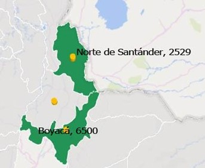
```

En cuanto a las existencias actuales, en la Figura \@ref(fig:NumeroRecRegAndinaNorte) se observan las cantidades descritas durante la visita de inmersión territorial, el departamento de Boyacá es el que más existencias tiene, debido a que su proceso de adquisición es lento (5 meses aprox.) y decidieron tener existencias aproximadas para 3-4 años, siendo un dato atípico en la región que hace este proceso anual. Ninguno de los departamentos presenta anomalías o desabastecimiento de recetarios oficiales.

```{r TiemposAdqRecRegAndinaNorte, fig.cap="Tiempos de adquisición de recetarios en la Región Andina Norte", fig.topcaption=TRUE, out.width="85%", message=FALSE, warning=FALSE, echo=FALSE}
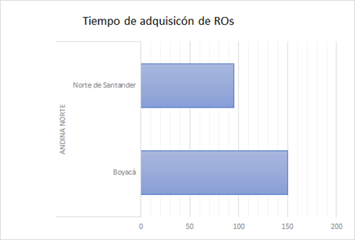
```

Sobre todo el proceso de venta y ganancias netas que deja la venta de recetarios oficiales en la región se puede observar que Boyacá y Norte de Santander. se puede observar que Boyacá es el que más margen de ganancia tiene sobre la venta de recetarios con 158% Figura \@ref(fig:PorcIngresosProvenientesRO), si se cruza esta información con el 40% que aporta la venta de los recetarios al total de los ingresos del FRE cómo se ve en la Figura \@ref(fig:PorcIngresosProvenientesRO), esta también podría ser una posible explicación de la prioridad de Stock que tiene este departamento, por otro lado, Norte de Santander maneja un Stock equilibrado también a sus necesidades que corresponde con proceso de adquisición mucho más rápido y eficiente en cuanto al despacho de los recetarios oficiales.

```{r PorcIngresosProvenientesRO, fig.cap="Porcentaje de ingresos provenientes del RO y conformidad respeto a la implementación del ROE", fig.topcaption=TRUE, out.width="85%", message=FALSE, warning=FALSE, echo=FALSE}
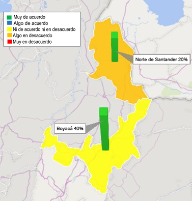
```

Un proceso crítico dentro del manejo de los recetarios oficiales, es la ordenanza o acto administrativo que fija sus precios, pues es la manera de controlar los precios de estos medicamentos y evitar que puedan existir barreras de acceso o procesos irregulares relacionados con la venta de los mismos. En la Figura \@ref(fig:PorcGananciasDepto) se puede observar qué en los departamentos analizados, sólo Norte de Santander no tiene ordenanza o un acto administrativo que fije los precios de los recetarios oficiales. Esto sucede porque por normativa departamental, este acto administrativo debe ser evaluado por la Asamblea de Norte de Santander, siendo un proceso largo que tiene un carácter mucho más político.

```{r PorcGananciasDepto, fig.cap="Porcentaje de ganancias en los departamentos", fig.topcaption=TRUE, out.width="85%", message=FALSE, warning=FALSE, echo=FALSE}
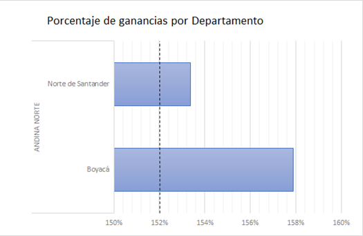
```

### Seguimiento y Control de RO

Para este ítem se observan comportamientos heterogéneos en los departamentos, por ejemplo para el departamento de Boyacá hacen el seguimiento de manera exhaustiva comparando las colillas de los recetarios oficiales entregados, con el libro de entrega de recetarios oficiales, también se evidencia que no hay ningún protocolo ante posibles Fraudes o desvíos, debido a que nunca han presentado un problema relacionado, pero acusan que en caso de darse, lo primero que harían sería un denuncio ante la policía. Mientras que el FRE Norte de Santander con los datos que hay en el sistema, también se coteja la información en las auditorias que hace el Instituto Departamental de Salud a los prestadores, también se evidencia que se siguen los protocolos de IVC del IDS en casos de posibles fraudes o desvíos, durante las visitas de IVC, hay recetarios que no vienen con el sello o con letra y estructura. Explican que hay una necesidad por la crisis fronteriza que tiene el departamento en la actualidad. Hay evidencia de un procesos sancionatorios por anomalías en la distribución de recetarios. 

Referente a la Seguridad de los recetarios, ambos departamentos tienen una gran confianza en ellos, sin embargo, se puede observar que el recetario del FRE Boyacá contiene mucho más distintivos de seguridad que el Norte de Santander, lo cual es crítico para un departamento que comparte una zona fronteriza tan grande con Venezuela.

### Recepción Consolidación e Inventario de RO

En ninguno de los departamentos evaluados se hace una recepción y consolidación de recetarios oficiales, pues manifiestan que tienen diferentes métodos para asegurarse que las cantidades solicitadas sean las indicadas y los pacientes de las instituciones existan, por ejemplo Norte de Santander recibe las cajas de inventarios solo para hacer contrarreferencia de las copias de los recetarios por los códigos y luego procede a destruir las cajas, no almacenan, mientras Boyacá recibe las cajas de la misma manera pero solo las acumula. Para el inventario de los recetarios oficiales que entran, solo se toma cómo almacenamiento muerto, pues no existe algún control real de recepción y consolidación en el caso de los departamentos que no hacen destrucción automática. en cuanto a las existencias nuevas de recetarios disponibles para venta, se realizan inventarios en conjunto con los medicamentos, hay un control de salidas y entradas de cantidades que se revisan semanalmente para verificar que no existan pérdidas, hasta el momento no existe alguna discrepancia o desvío reportado de recetarios.

### Ruta tecnológica.
En general la región Andina se caracteriza por tener una conectividad de internet muy buena, rutas de fácil acceso y tecnología suficiente en sus instalaciones, hasta el momento ninguno de los FRE evaluados ha tenido problemas de conectividad a internet u obsolescencia en equipos de cómputo (Figura \@ref(fig:ConexionInternetRecRegAndinaNorte)), incluso departamentos cómo Norte de Santander manejan el funcionamiento del FRE con programas propios de la Gobernación. en el caso de Boyacá se ha evidenciado que si bien muchos de los procesos los maneja de manera manual, esto se hace más por decisión propia que por alguna falla tecnológica en la región (Figura \@ref(fig:CuentasOrdenanza1)).

```{r CuentasOrdenanza1, fig.cap="Cuenta con ordenanza", fig.topcaption=TRUE, out.width="85%", message=FALSE, warning=FALSE, echo=FALSE}
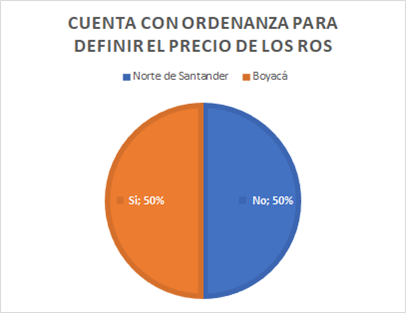
```

```{r ConexionInternetRecRegAndinaNorte, fig.cap="Evaluación de la conexión de internet", fig.topcaption=TRUE, out.width="85%", message=FALSE, warning=FALSE, echo=FALSE}
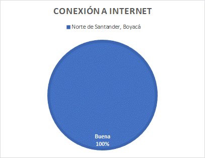
```


```{r softwareTecnologia, echo=FALSE, warning=FALSE, message=FALSE, tab.caption = "Presencia de software para el manejo tecnológico"}
tibble::tribble(
        ~Departamento, ~Anexos, ~Inventarios, 
              "Boyacá",     "No",          "No", 
  "Norte de Santander",     "Si",          "Si"
  ) %>% kable(longtable = TRUE, booktabs = TRUE,
  caption = 'Presencia de software para el manejo tecnológico')
```

### Proyección de Compra MME

Cómo se mencionó en el inciso de los recetarios oficiales, los FRE evaluados de la Región Andina Norte solo participan de manera activa en  los estudios previos de todo el proceso de contratación para cualquiera sea la ocasión, por esta razón si bien tienen claridad sobre la demora en los tiempos de cada parte del proceso que no llevan a cabo, no tienen una idea más allá de la complejidad o realización de estos pasos. En Norte de Santander se comparan consumos históricos y fechas de vencimiento, ponen cómo ejemplo que no se puede comprar Metilfenidato de 10mg porque se encuentra a punto de vencerse, en este FRE se manejan cortes semestrales pero un solo registro anual de compras, En Boyacá hace principalmente dos compras al año, las cuales son estimadas observando el consumo anual y las necesidades que hayan manifestado los clientes, a esta cifra se le incrementa un 10% debido a que suelen llegar menos medicamentos de los solicitados al Fondo Nacional de Estupefacientes o para tener una reserva corta. En Santander...

### Recepción técnica.

La recepción técnica suele ser un tema que está estandarizado en los diferentes FRE, pero hay particularidades que es importante resaltar con el fin de entender mejor este proceso y qué variables pueden ser influyentes. Lo más relevante para destacar es que en el FRE Boyacá, se toman tres días para hacer la recepción técnica, debido a que es la encargada del FRE la que se encarga personalmente de hacer la recepción, ralentizando el proceso al volverlo unipersonal, esto no quiere decir que el talento humano relacionado al FRE no colabore, sino que el procedimiento de llenado de actas y revisión de calidad de los MME lo hace la encargada sola. Sin embargo, que esta recepción se haga en un periodo largo, no ha 

### Almacenamiento e inventario de MME

### Proceso de distribución a instituciones y pacientes

```{r ColombiaCompraEficienteRecRegAndinaNorte, fig.cap="Percepción de Colombia Compra Eficiente", fig.topcaption=TRUE, out.width="85%", message=FALSE, warning=FALSE, echo=FALSE}
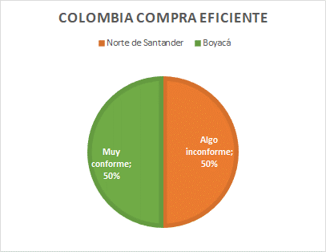
```

```{r warning=FALSE, echo=FALSE, message=FALSE, tab.cap="Tabla de Región Andina Norte 1", out.width="100%"}
read_excel("figures/TablaRegionAndinaNorte.xlsx", sheet = "Parte1") %>% 
  mutate(across(matches('\\d'), ~str_wrap(.x, 35))) %>% 
  kable(longtable = TRUE, booktabs = TRUE, escape = T,
  caption = 'Tabla de Región Andina Norte 1') %>% 
  kableExtra::kable_styling(font_size = 8, latex_options = c("hold_position", "repeat_header"))
```

```{r warning=FALSE, echo=FALSE, message=FALSE, tab.cap="Tabla de Región Andina Norte 2", out.width="100%"}
read_excel("figures/TablaRegionAndinaNorte.xlsx", sheet = "Parte2") %>% 
  rename(Departamento = '...1') %>% 
  mutate(across(matches('\\d'), ~str_wrap(.x, 35))) %>% 
  kable(format = "latex", longtable = TRUE, booktabs = TRUE, escape = T,
  caption = 'Tabla de Región Andina Norte 2') %>% 
  kableExtra::kable_styling(font_size = 8, latex_options = c("hold_position", "repeat_header"))
```

## Región Andina Sur

### Adquisición, Venta y Distribución de RO

La región Andina sur, comprendida por los departamentos de Antioquia, Quindío, Huila, Tolima, Risaralda y Caldas, exhibe de manera general un adecuado manejo de los recetarios oficiales en su adquisición, venta y distribución. No obstante, se observa un territorio atípico el cual no cuenta actualmente con existencias de recetarios oficiales, correspondiendo al departamento del Huila. Sobresale que en este territorio la proyección de necesidad de recetarios oficiales requerida para cubrir las necesidades del departamento, es realizada a partir de un simple cálculo, contemplando únicamente la información asociada con la última compra de recetarios oficiales. Además, el FRE Huila no contempla ningún tipo de base de datos o herramienta para la proyección de la necesidad de estos recetarios oficiales, lo que da muestra de un proceso distinto en comparación a los territorios de Antioquia y Quindio. Así las cosas, se observa la gran importancia que cumple la proyección de necesidad de compra de recetarios oficiales, contemplando múltiples variables de cada territorio, para evitar escenarios como en el territorio del Huila.  A continuación, se presenta la Figura \@ref(fig:DisponibRecetarioRegionAndinaSur), para ilustrar la disponibilidad de recetarios oficiales en la región Andina sur.

```{r DisponibRecetarioRegionAndinaSur, fig.cap="Disponibilidad de recetarios oficiales en la región Andina sur", fig.topcaption=TRUE, out.width="50%", message=FALSE, warning=FALSE, echo=FALSE}
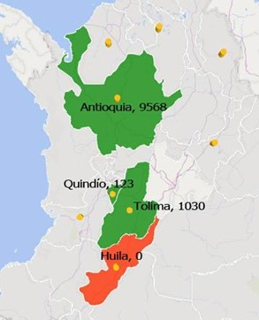
```

Por otra parte, el tiempo de adquisición de los recetarios oficiales en la región Andina sur oscila entre 75 días y 90 días, a diferencia del FRE Quindío, considerándose un dato atípico entre la región, cuyo tiempo de adquisición puede ser menor a los 20 días. A grandes rasgos, se evidencia un tiempo relativamente largo para adquirir estos recetarios oficiales, lo que implicaría una adecuada planeación en los procesos de adquisición por parte de cada FRE, para evitar un déficit de recetarios oficiales en el territorio. La siguiente Figura \@ref(fig:TiempoAdquisicionRegionAndinaSur), muestra los tiempos de cada territorio en la adquisición de los recetarios oficiales.
 
```{r TiempoAdquisicionRegionAndinaSur, fig.cap="Tiempos en la adquisición de los recetarios oficiales para cada FRE", fig.topcaption=TRUE, out.width="50%", message=FALSE, warning=FALSE, echo=FALSE}
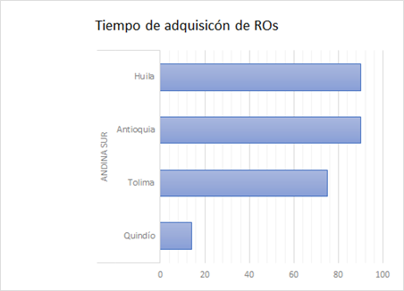
```

En relación al porcentaje de ganancias que tiene cada ente territorial a partir de la venta de los recetarios oficiales, se observa que este margen de ganancia puede estar comprendido entre el 250% y 440% respecto al valor de adquisición del mismo. Para cada FRE, esta es una cantidad importante de ganancia que respalda en gran medida su autosostenimiento y contribuye a los recursos indispensables para el correcto funcionamiento del ente territorial. El departamento que más ganancias obtiene a partir del recetario oficial es Quindío con un 440%, a diferencia de Antioquia que es considerado el departamento que menos ganancias obtiene, siendo el 250%. A continuación, se presenta la Figura \@ref(fig:PorcAdquisicionRegionAndinaSur), en relación a este margen de ganancias en cada FRE.
 
```{r PorcAdquisicionRegionAndinaSur, fig.cap="Porcentaje de ganancias que tiene cada FRE a partir de la venta de los recetarios oficiales", fig.topcaption=TRUE, out.width="50%", message=FALSE, warning=FALSE, echo=FALSE, fig.align='center'}
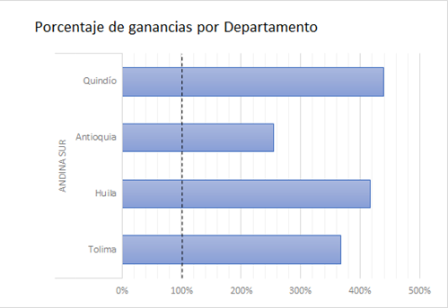
```

Continuando con el análisis de las ganancias obtenidas a partir de los recetarios oficiales, en cada FRE, se contempla el porcentaje de ingresos provenientes de los recetarios oficiales respecto a todos los ingresos que recibe el ente territorial. Se observa que Antioquia es el departamento que menos porcentaje de ingresos recibe, el 3%, considerando la totalidad de los ingresos que tiene. Caso diferente en el territorio del Tolima, cuyo ente territorial recibe el 70% de sus ingresos, a partir de la venta de los recetarios oficiales. Esta situación puede estar relacionada directamente con la percepción que cada ente territorial tiene respecto a la implementación del Recetario oficial electrónico (ROE). De acuerdo al análisis, los FRE pueden verse perjudicados con esta implementación, ya que dejarían de percibir los ingresos generados con las ventas de los recetarios oficiales y su sensación al respecto puede incidir en el autosostenimiento del ente territorial. No obstante, departamentos como Antioquia y Huila consideran que la implementación del ROE es favorable, partiendo de la idea que este brindaría mayor oportunidad de seguimiento, trazabilidad y seguridad. A continuación se presenta la Figura \@ref(fig:PorcIngresosProcRegionAndinaSur), donde se ilustra el porcentaje de ingresos provenientes del Recetario oficial y la conformidad de cada FRE, respecto a la implementación del Recetario oficial electrónico (ROE).
 
```{r PorcIngresosProcRegionAndinaSur, fig.cap="Porcentaje de ingresos provenientes del Recetario oficial y conformidad respecto a la implementación del Recetario oficial electrónico (ROE)", fig.topcaption=TRUE, out.width="50%", message=FALSE, warning=FALSE, echo=FALSE, fig.align='center'}
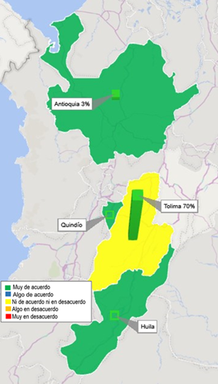
```

```{r OrdenanzasRegionAndinaSur, fig.cap="Porcentaje de los FRE que cuentan con ordenanza para definir el costo de los recetarios oficiales", fig.topcaption=TRUE, out.width="50%", message=FALSE, warning=FALSE, echo=FALSE, fig.align='center'}
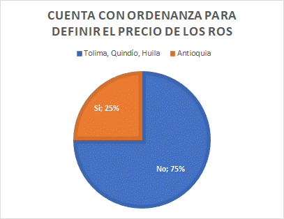
```

Por otro lado, es importante resaltar el porcentaje de los entes territoriales en la región Andina sur, que cuentan con acto administrativo, resolución u ordenanza donde esté definido el costo de los recetarios oficiales. Únicamente el 25% de los departamentos que conforman la región Andina sur, cuentan con este tipo de acto administrativo. Antioquia es el departamento que ha definido e implementado este acto administrativo, los demás entes territoriales no han definido aún esta ordenanza y algunos FRE manifiestan que están en proceso de implementación. La Figura \@ref(fig:OrdenanzasRegionAndinaSur) exhibe el porcentaje de los territorios que cuentan con ordenanza para definir el costo de los recetarios oficiales.

### Seguimiento y Control de RO

Respecto al seguimiento y control de los recetarios oficiales en la región Andina sur, se observa que la mayoría de los departamentos llevan a cabo un control adecuado de las existencias o saldos de los recetarios oficiales, a excepción del FRE Huila que actualmente no tiene existencias y tiene en marcha el plan de contingencia con los recetarios oficiales. El FRE Quindío y FRE Antioquia son los entes territoriales que no contemplan un escenario de desabastecimiento de recetarios oficiales, debido a sus procesos sólidos en relación a la proyección de la necesidad de recetarios en sus territorios respectivamente. No obstante, todos los departamentos de la región Andina sur, consideran y estiman actividades ante la posibilidad de escenarios de fraudes o desvíos de los recetarios oficiales.

La mayoría de los entes territoriales cuentan con dos actividades principales para llevar el correcto seguimiento al uso de los recetarios. Estas actividades corresponden a la verificación en la base de datos de ventas de recetarios oficiales y las visitas de vigilancia a las instituciones o prestadores independientes. Estas actividades son un gran apoyo para la consolidación de esta información de manera periódica, además las visitas de vigilancia a las instituciones y prestadores independientes es la actividad de mayor impacto que gestionan los entes territoriales. A partir de lo anterior, la región Andina sur presenta un seguimiento cercano y un control efectivo, en cuanto al manejo de los recetarios.

### Recepción Consolidación e Inventario de RO

En relación a la recepción y consolidación de los recetarios oficiales en la región Andina sur, se observa una tendencia en la mayoría de los departamentos, a no recibir estos recetarios oficiales y conferir esta responsabilidad a cada institución, IPS o prestador de servicios independiente. Antioquia no hace recepción ni consolidación de los recetarios oficiales, igual que los entes territoriales del Tolima y Huila. Este último FRE, anteriormente si ejecutaba la recepción de los recetarios oficiales, sin embargo, por el limitado recurso humano que tiene el FRE actualmente, se dejó de hacer. El único territorio que efectúa esta recepción de recetarios es el departamento de Quindío, no obstante, el personal vinculado al FRE no lleva alguna base de datos donde se diligencie esta información contenida en los recetarios oficiales.

En este sentido, podría afirmarse que ningún departamento de la región Andina sur lleva a cabo la consolidación e inventario de la información comprendida en los recetarios oficiales que retornan al FRE de cada territorio. La razón principal por la que no se lleva a cabo este proceso internamente en el FRE es el escaso recurso humano.

### Ruta tecnológica.

En términos generales la región Andina Sur, cuenta con las herramientas necesarias para el correcto desarrollo de las actividades por parte de los FRE, dispuestas en las Resoluciones 1478 y 1479 de 2006. Como se observa en la Tabla \@ref(tab:softwareTecnologiaRegAndinaSur), únicamente el FRE del departamento de Tolima no cuenta con herramientas tecnológicas como un software adquirido o implementado. Sin embargo, posee un paquete ofimático para el manejo y consolidación de los inventarios y anexos establecidos en las regulaciones nacionales que deben ser presentados ante el FNE.

```{r softwareTecnologiaRegAndinaSur, echo=FALSE, warning=FALSE, message=FALSE, tab.caption = "Entes territoriales que cuentan con software para el manejo de anexos e inventarios en la región Andina Sur"}
tibble::tribble(
          ~Departamento, ~Anexos, ~Inventarios, 
     "Tolima", "No", "No", 
  "Antioquia", "Si", "Si", 
      "Huila", "Si", "Si", 
    "Quindío", "Si", "Si"
  ) %>% kable(longtable = TRUE, booktabs = TRUE, 
  caption = 'Presencia de software para el manejo tecnológico')
```

Cabe resaltar que cuentan con tan solo dos equipos de cómputo que deben ser cambiados por obsolescencia para el desenvolvimiento de las tareas del FRE. Este es un factor determinante para la entrada de nuevas tecnologías digitales como lo es el ROE, ya que la capacidad tecnológica de los territorios determinará la aptitud del FRE en cuanto a la posibilidad de implementar las plataformas tecnológicas.
Ligado a el hardware y software con los que cuentan los entes territoriales, es para este proyecto fundamental conocer el estado actual de la conexión a internet con la que cuentan las entidades regionales, es por ello que en el Diagrama \@ref(fig:ConexionInternetRegionAndinaSur), se describe la percepción por parte de los funcionarios de los FRE de la región Andina Sur ante la capacidad de conexión en sus oficinas y que tan oportuno es ante el correcto desarrollo de sus funciones. Se puede observar la tendencia favorable de la conexión en esta región, por lo que por lo menos en lo concerniente a capacidad tecnológica en la región, se puede concluir que es apta para la entrada de nuevas tecnologías e implementación de plataformas como el ROE y demás herramientas que requieran una considerable capacidad tecnológica para la mejora en la trazabilidad y seguimiento de procesos como lo son la prescripción de MME y la consolidación de anexos de las resoluciones 1478 y 1479 de 2006.

```{r ConexionInternetRegionAndinaSur, fig.cap="Estado actual de la conexión a internet de los FRE de la región Andina Sur.", fig.topcaption=TRUE, out.width="50%", message=FALSE, warning=FALSE, echo=FALSE, fig.align='center'}
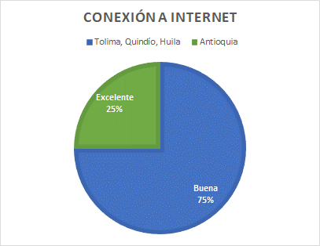
```

### Proyección de Compra MME

Pese a que en algunos FRE la estimación de compra no se realice de manera estandarizada, en lo general la región Andina Sur, la estimación de compra se efectúa a través de aplicativos y plataformas digitales que poseen los entes territoriales para el manejo e inventario de MME, el cual da el dato de consumo histórico del departamento, permitiendo un pedido dirigido al FNE fidedigno con la utilización de los pacientes en el departamento.
Con la implementación de Colombia compra eficiente para la adquisición de MME, se han encontrado posturas que tienden a una opinión favorable por parte de los FRE de la región Andina Sur. Es así como lo expone el Diagrama \@ref(fig:PercepcionCompraEfRegionAndinaSur), en donde el 50% de los FRE no cuenta con una postura definida ante la plataforma, pero el otro 50% de la población de estudio tiene una percepción algo conforme y muy conforme de la herramienta digital.

```{r PercepcionCompraEfRegionAndinaSur, fig.cap="Percepción de los FRE de la región Andina Sur respecto a Colombia compra eficiente", fig.topcaption=TRUE, out.width="50%", message=FALSE, warning=FALSE, echo=FALSE, fig.align='center'}
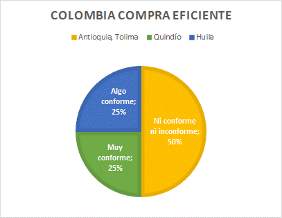
```

Este indicador nos habla de la adecuada captación de parte de los FRE de está region hacia las capacitaciones en torno al manejo de la plataforma Colombia compra eficiente, que a nivel nacional es un aspecto necesario y útil para los FRE con poca experiencia.

### Recepción técnica.
En cuanto al proceso de recepción técnica entre los FRE de la región Andina Sur, se observa un patrón general en la recepción administrativa del producto en primera instancia, en donde donde se verifican las unidades solicitadas con la orden de compra. Posteriormente se lleva a cabo la recepcion tecnica, en la cual se hace revision de condiciones fisicas del producto, averias o producto no conforme. Este proceso se lleva a cabo generalmente por un regente en farmacia el cual hace la recepción en compañía de un apoyo que puede ser el encargado del FRE. Dependiendo del tamaño del departamento y el consumo de MME puede tardar entre uno y 5 días laborales. Como se observa en el Diagrama \@ref(fig:TiempoRecepcionTecnicaRegionAndinaSur), el FRE que más tarda en hacer la revisión técnica del producto es Antioquia, ya que es el departamento de más alto consumo a nivel nacional. Por otra parte, los FRE como Huila o Quindio con menor rotación de medicamentos y menor población bajo su jurisdicción pueden realizar el proceso de recepción en un día de trabajo.

```{r TiempoRecepcionTecnicaRegionAndinaSur, fig.cap="Tiempo de recepción técnica y almacenamiento de los FRE en la región Andina Sur", fig.topcaption=TRUE, out.width="80%", message=FALSE, warning=FALSE, echo=FALSE, fig.align='center'}
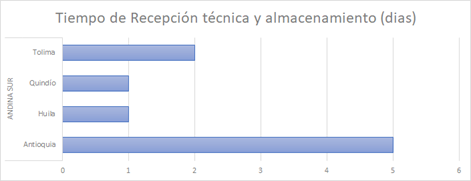
```

Culminado el proceso de recepción de medicamentos y de asegurarse que la orden de compra está completa y conforme, se procede a realizar un acta de recepción, seguido del almacenamiento de los productos en el área dispuesta para ello.

### Almacenamiento e inventario de MME

```{r EtapasProcesoRegionAndinaSur, fig.cap="Ponderación de procesos de adquisición en región Andina Sur", fig.topcaption=TRUE, out.width="100%", message=FALSE, warning=FALSE, echo=FALSE, fig.align='center'}
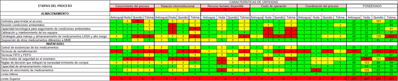
```

Respecto al proceso de almacenamiento se observa que de los departamentos hasta el momento acompañados, solamente Antioquia dispone de herramientas de control suficientes en cuanto acceso al área, en departamentos como Huila, Tolima y Quindío se tienen oportunidades de mejora en cuanto a fortalecer los sistemas de seguridad. De hecho, para el Departamento del Huila son conocidas las denuncias de robos de MME en años anteriores. Adicionalmente el Departamento de Quindío, comparte espacio con medicamentos de programas como Enfermedades de Transmisión por Vectores (ETV) y tuberculosis (TBC), por cuanto esto no es lo ideal de acuerdo a la Resolución 1978 de 2006. Sumado a lo anterior el Departamento del Quindío como agravante de riesgo tiene que aún con medicamentos diferentes a MME, no consideran necesario establecer estrategias de almacenamiento tipo MAR y LASA.

Los FRE no realizan estrategias de marcación LASA y de alto riesgo, puesto que no lo ven necesario, ya que consideran la disposición de los MME como de fácil identificación y ubicación, disponen de otras técnicas de almacenamiento por grupo terapéutico, forma farmacéutica y orden alfabético, ó dejan esta marcación como tarea delegada a las IPS que si realizan procesos de entrega directa y educación a los pacientes. 

El control de las condiciones de almacenamiento se evidencia como un proceso altamente adherido a los FRE acompañados, se comprende la importancia de realizar dichos controles y se dispone en términos generales de los equipos necesarios al dia en los requerimientos de mantenimiento y calibración. La principal excepción a esta generalidad se presenta en el Departamento del Huila en donde debido a un trámite en proceso, en el cual se debe contar con el apoyo y aval financiero de la Gobernación, no ha sido posible reemplazar/calibrar el viejo y adquirir el termohigrómetro.

Por otro lado, si bien se evidencia un alto conocimiento de los procesos de almacenamiento por parte de la coordinación de los FRE, la cual suele ser de 1 a 2 personas por contratos de prestación de servicios en su mayoría, lo que en últimas retiene altas cargas de trabajo en pocas personas, y es esto mismo un factor para evidenciar que Departamentos como Huila, Tolima Y en especial Quindío no tengan POE definidos o con actualizaciones pendientes en este proceso. 

Respecto al inventario de los MME, se evidencia que los 4 departamentos poseen un buen manejo de existencias de los mismos, debido a que en ningún momento se ha visto un riesgo de desabastecimiento. Sin embargo, se observa que los Departamentos con excepción del Huila, no poseen técnicas de semaforización impidiendo el control de la rotación de los MME. Dentro del acompañamiento, se encontró que el Departamento de Antioquia no tenía conocimiento de esta estrategia. A pesar de esto, todos los departamentos manejan las técnicas FIFO y FEFO para evitar el vencimiento de medicamentos puesto que a veces se distribuyen desde FNE con fechas de vencimiento próximas.

Adicionalmente, se detectó que sólo Antioquia tiene niveles mínimos de existencias de inventario para productos definidos antes de confirmar la necesidad de compra de MME, siendo una preocupación en los demás departamentos puesto que no se entiende cómo realizan la proyección. Como por ejemplo, el departamento de Huila, el cual ha tenido demandas insatisfechas por parte de algunas Instituciones. 

Por último, se comprende como oportunidad de mejora y seguimiento para el departamento del Huila la necesidad de revisar a detalle las existencias y manejo de productos considerados para el departamento de baja rotación los cuales se identifica un alto riesgo de vencimiento. 

### Proceso de distribución a instituciones y pacientes
Para el punto de la venta directa a pacientes, el departamento del Tolima realiza el proceso teniendo en cuenta de que es exclusivo para aquellos pacientes que son atendidos por médicos independientes y para los casos específicos donde el servicio farmacéutico no tenga disponibilidad del medicamento. El FRE hace llamada al servicio farmacéutico, para confirmar la no disponibilidad del medicamento, de ser así continúa la venta directa a pacientes. Se corrobora información del paciente y se examina el estado actual de abastecimiento del MME en el territorio.

Por otro lado, tenemos a los departamentos como Antioquia y Quindío, donde tienen filiales de droguerías que realizan la venta directa a pacientes, descentralizando esta función al FRE. Los  mismos, se encargan de capacitar y hacer seguimiento a los establecimientos para evitar el desvìo de MME. Sin embargo, el departamento de Huila, el cual realiza la venta directa a pacientes, se encontró que los controles realizados para la venta directa a pacientes no se cumplen en la totalidad de las ventas, efecto que podría generar un aumento en las posibilidades de encontrar escenarios de fraude o desvíos.

## Región Caribe 

```{r porcentajeGananciasRegionCaribe, fig.cap="Porcentaje de ganancias en el departamento para la region Caribe", fig.topcaption=TRUE, out.width="50%", message=FALSE, warning=FALSE, echo=FALSE, fig.align='center'}
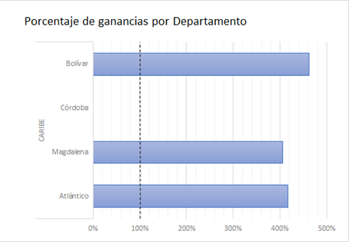
```

```{r tiemposAdquisicionRegionCaribe, fig.cap="Tiempos de adquisición de recetarios en el departamento para la region Caribe", fig.topcaption=TRUE, out.width="50%", message=FALSE, warning=FALSE, echo=FALSE, fig.align='center'}
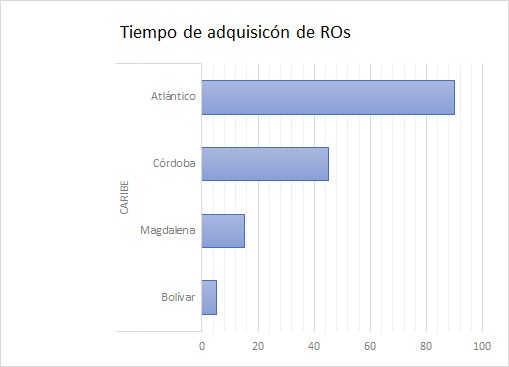
```

- ATLÁNTICO
- BOLÍVAR
- CESAR
- CÓRDOBA
- GUAJIRA
- MAGDALENA
- SAN ANDRÉS Y PROVIDENCIA
- SUCRE

## Región Orinoquía

```{r porcentajeGananciasRegionOrinoquia, fig.cap="Porcentaje de ganancias en el departamento para la region Orinoquía", fig.topcaption=TRUE, out.width="50%", message=FALSE, warning=FALSE, echo=FALSE, fig.align='center'}
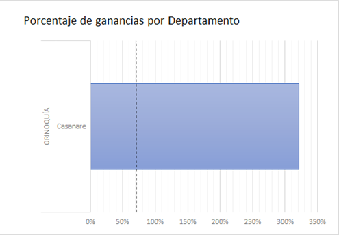
```

```{r tiemposAdquisicionRegionOrinoquia, fig.cap="Tiempos de adquisición de recetarios en el departamento para la region Orinoquía", fig.topcaption=TRUE, out.width="50%", message=FALSE, warning=FALSE, echo=FALSE, fig.align='center'}
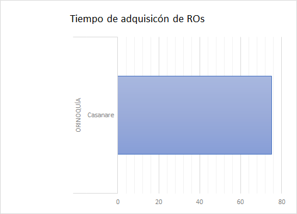
```

- CASANARE
- META
- ARAUCA
- VICHADA

## Región Pacífica
 
```{r porcentajeGananciasRegionPacifica, fig.cap="Porcentaje de ganancias en el departamento para la region Pacífica", fig.topcaption=TRUE, out.width="50%", message=FALSE, warning=FALSE, echo=FALSE, fig.align='center'}
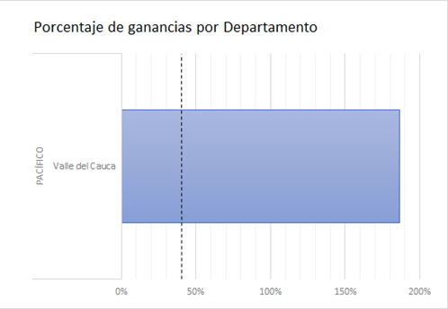
```

```{r tiemposAdquisicionRegionPacifica, fig.cap="Tiempos de adquisición de recetarios en el departamento para la region Pacífica", fig.topcaption=TRUE, out.width="50%", message=FALSE, warning=FALSE, echo=FALSE, fig.align='center'}
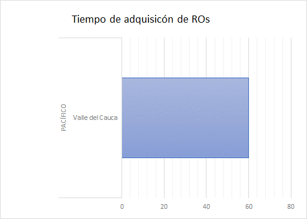
```
 
- CAUCA
- CHOCÓ 
- NARIÑO 
- VALLE DEL CAUCA

# Lineamientos y Recomendaciones Generales

 

<!--chapter:end:L301_Regional.Rmd-->

# Glosario {-}

- **Alerta Sanitaria**: Toda sospecha de una situación de riesgo potencial para la salud de la población y/o de trascendencia social, frente a la cual sea necesario el desarrollo de acciones de Salud Pública urgentes y eficaces.

- **Compra Directa**: compra de medicamentos monopolio del Estado por parte de entidades administradoras de planes de beneficios, prestadores de servicios de salud o establecimientos farmacéuticos, cuando el respectivo Fondo Rotatorio de Estupefacientes no cuenta con inventario suficiente de los medicamentos monopolio del Estado que se necesitan.

- **Desabastecimiento**: Se entiende como la nula disponibilidad de un medicamento en todo el territorio nacional. 

- **Disponibilidad**: Condición en la cual se cuentan con existencias del medicamento en el territorio nacional.

- **Farmacovigilancia**: Ciencia y actividades relacionadas con la detección, evaluación, comprensión y prevención de eventos adversos o de cualquier otro problema relacionado con medicamentos.

- **Fondo Nacional de Estupefacientes**: Creado por la Ley 36 de 1939 con asignaciones dadas por el Decreto-Ley 257 de 1969, según el Decreto 205 de 2003 funciona como una Unidad Administrativa Especial adjunta de la Dirección de Medicamentos y Tecnologías en Salud. El FNE (Fondo Nacional de Estupefacientes) tiene como objetivo la vigilancia y control sobre la importación,  la exportación, la distribución y venta de drogas, medicamentos, materias primas o precursores de control especial, a que se refiere la Ley 30 de 1986 y las demás disposiciones que expida el Ministerio de la Protección Social, así como apoyar a los programas contra la farmacodependencia que adelanta el Gobierno Nacional.

- **Fondo Rotatorio de Estupefacientes (FRE)**: Es la oficina encargada dentro de la Secretaría, Instituto o Dirección de Salud a nivel departamental, que ejerce la vigilancia, seguimiento y control a las entidades públicas, privadas y personas naturales que procesen, manipulen, sinteticen, fabriquen, distribuyan, vendan, consuman, dispensen sustancias sometidas a fiscalización y medicamentos que las contengan; así como garantizar la disponibilidad de medicamentos monopolio del Estado a través de la dispensación y distribución en su jurisdicción y las demás funciones que le sean asignadas por el Ministerio de la Protección Social, o la institución competente.

- **Materia Prima de Control Especial o Sustancia Sometida a Fiscalización**: Es toda sustancia cualquiera que sea su origen, que produce efectos mediatos e inmediatos de dependencia psíquica o física en el ser humano; aquella que por su posibilidad de abuso, pueda tener algún grado de peligrosidad en su uso, o aquella que haya sido catalogada como tal, en los convenios internacionales, por el Ministerio de la Protección Social, o la Comisión Revisora del Invima. Dentro de estas se incluyen los estándares de referencia, patrones y reactivos.

- **Medicamento de Control Especial (MCE)**: Producto farmacéutico obtenido a partir de sustancias que tienen alto potencial de dependencia y abuso, que actúan sobre el sistema nervioso central produciendo efectos neuro-psicofisiológicos y aquellas consideradas por el gobierno nacional.

- **Medicamento Monopolio del Estado**: Producto farmacéutico de adquisición, distribución y venta exclusiva del Fondo Nacional de Estupefacientes y los Fondos Rotatorios de Estupefacientes o los establecimientos facultados por el FNE para estas actividades.

- **Medicamento Sometido a Fiscalización de Uso Humano o Veterinario**: Es el preparado farmacéutico obtenido a partir de uno o más principios activos de control especial, catalogados como tal en las convenciones de estupefacientes (1961), precursores (1988) y psicotrópicos (1971), o por el Gobierno Nacional, con o sin sustancias auxiliares presentado bajo forma farmacéutica definida, que se utiliza para la prevención, diagnóstico, tratamiento, curación o rehabilitación de las enfermedades de los seres vivos.

- **Monopolio del Estado**: Derecho poseído de exclusividad por el Estado. 

- **Principio Activo**: Compuesto o mezcla de compuestos que tienen acción farmacológica.  

- **Recetario Oficial (RO)**: Documento oficial autorizado por la entidad competente, de carácter personal e intransferible que utilizan los prescriptores de salud para la formulación de los medicamentos de control especial y de Monopolio del Estado.

- **Recetario Oficial Electrónico (ROE)**: Documento electrónico que se pretende parametrizar en todos los FRE, con el fin de fortalecer el seguimiento a las prescripciones de medicamentos monopolio del Estado, encaminados al uso racional de estos medicamentos en todo el territorio nacional.

- **Servicio Farmacéutico**: Es el servicio de atención en salud responsable de las actividades, procedimientos e intervenciones de carácter técnico, científico y administrativo, relacionado con los medicamentos y los dispositivos médicos utilizados en la promoción de la salud y la prevención, diagnóstico, tratamiento y rehabilitación de la enfermedad, con el fin de contribuir en forma armónica e integral al mejoramiento de la calidad de vida individual y colectiva.

- **Sustancia Monopolio del Estado**: Sustancia química cuya adquisición, manejo y destrucción es exclusiva del Fondo Nacional de Estupefacientes y es destinada para la fabricación de medicamentos monopolio del Estado.

- **Traslado Interdepartamental**: Es la actividad en la cual se autoriza por parte del FNE, de manera excepcional, el traslado interdepartamental de medicamentos monopolio del Estado por parte de diferentes filiales de la misma entidad, si el Fondo Rotatorio no cuenta con inventario suficiente de los medicamentos monopolio del Estado que se necesitan.

- **Préstamo entre los FRE**: Es la modalidad en la cual se autoriza a los FRE a prestarse entre ellos medicamentos monopolio del Estado sin la necesidad de la autorización del FNE, con el fin de suplir los riesgos de desabastecimiento que hubiere a lugar y dar rotación a medicamentos que estén próximos a vencerse.

<!--chapter:end:L500_Glosario.Rmd-->

# Créditos {-}

### Grupo Desarrollador {-}

```{r include=FALSE}
bloqueContactos <-
    function(Nombre = 'Nombre',
             Cargo = 'Cargo',
             ruta = "./credit_figures/person_icon.jpg",
             altura = 15, # rem
             ancho = '50%',
             img_alt = "person_icon_logo") {
      #
      tags <- htmltools::tags
      principal <- glue::glue("width: {ancho}; 
                              flex-direction: row; 
                              display: flex; 
                              height: {altura}rem;")
      
      tags$div(
        tags$div(tags$img(src = ruta, alt = img_alt, 
                          style = 'border-radius: 50%', height='80%'),
                 style = "display: flex; width: 30%;"),
        tags$div(
          tags$div(tags$strong(Nombre, display='block'),
                   style = "display:flex; justify-content:center; align-items:center; height: 45%; padding: 4rem;"),
          tags$div(tags$i(Cargo, display='block'),
                   style = "display:flex; justify-content:center; align-items:center; height: 45%; padding: 4rem;"),
          style = paste('display: flex', 
                        'flex-direction: column', 
                        'justify-content: space-around',
                        'align-content: space-around',
                        ' width: 70%',
                        sep = ';')
        ),
        style = principal
      )
    }
credits_fig <- file.path('.', 'credit_figures')


crearListaLatex <- function(lista) {
  cat("\\begin{itemize}")
  for (j in seq_along(lista)) {
    cat('\\item ', lista[j])
  }
  cat("\\end{itemize}")
}
```


<hr>
**Coordinación**
<br>
```{r creditos1, echo=FALSE, warning=FALSE, results="asis"}
tag1 <- htmltools::tags

box1 <- tag1$div(
  bloqueContactos('Diego Alejandro Socha Cuitiva', 'Dirección de proyecto',
                  './credit_figures/diego.jpg'),
  bloqueContactos('Hillary Andrea Gómez Guerra', 'Coordinación de proyecto',
                  './credit_figures/hillary.jfif'),
  style = paste('width: 100%',
                'display: flex',
                'align-items: flex-start',
                'flex-wrap: wrap',
                'justify-content: space-around',
                sep = ';')
)
# 
box2 <- 
crearListaLatex(c('Diego Alejandro Socha Cuitiva (Dirección de proyecto)', 
                  'Hillary Andrea Gómez Guerra (Coordinación de proyecto)'))
# 
if(knitr::is_html_output()){
  box1
} else {
  invisible(box2)
}
```

<hr>
**Apoyo**
<br>
```{r, echo=FALSE, warning=FALSE, results="asis"}
box1 <- tag1$div(
  bloqueContactos('Carlos Andres Acosta Pinto', 'Profesional de Apoyo Operativo',
                  './credit_figures/carlos.jfif'),
  bloqueContactos('Daniela del Pilar Carvajal Latorre', 'Profesional de Apoyo Operativo',
                  './credit_figures/daniela.jfif'),
  style = paste('width: 100%',
                'display: flex',
                'align-items: flex-start',
                'flex-wrap: wrap',
                'justify-content: space-around',
                sep = ';')
)
# 
box2 <- 
crearListaLatex(c('Carlos Andres Acosta Pinto (Profesional de Apoyo Operativo)', 
                  'Daniela del Pilar Carvajal Latorre (Profesional de Apoyo Operativo)'))
# 
if(knitr::is_html_output()){
  box1
} else {
  invisible(box2)
}
```

<hr>
**Realización de encuestas**
<br>
```{r, Realización de encuestas, echo=FALSE, warning=FALSE, results="asis"}
box1 <- tag1$div(
  bloqueContactos('Carlos Guillermo Leal Jimenez', 'Profesional de equipo técnico territorial',
                  './credit_figures/guillermo.jfif', altura = 15),
  bloqueContactos('Jhonathan Felipe Venegas Parra', 'Profesional de equipo técnico territorial',
                  './credit_figures/jonathan.jfif', altura = 15),
  bloqueContactos('Nicolás Alexander Cadena Ayala', 'Profesional de equipo técnico territorial',
                  './credit_figures/nicolas.jfif', altura = 15),
  bloqueContactos('Wilder Estiben Meneses Garavito', 'Profesional de equipo técnico territorial',
                  './credit_figures/estiben.jfif', altura = 15),
  style = paste('width: 100%',
                'height: 35 rem',
                'display: flex',
                'align-items: flex-start',
                'flex-wrap: wrap',
                'justify-content: space-around',
                'align-content: space-around',
                sep = ';')
)
# box2 <- tag1$ul(
#   tag1$li('Jhonathan Felipe Venegas Parra (Profesional de equipo técnico territorial)'),
#   tag1$li('Nicolás Alexander Cadena Ayala (Profesional de equipo técnico territorial)'),
#   tag1$li('Carlos Guillermo Leal Jimenez (Profesional de equipo técnico territorial)'),
#   tag1$li('Wilder Estiben Meneses Garavito (Profesional de equipo técnico territorial)')
# )
# 
box2 <- crearListaLatex(
  c(
    'Carlos Guillermo Leal Jimenez (Profesional de equipo técnico territorial)',
    'Jhonathan Felipe Venegas Parra (Profesional de equipo técnico territorial)',
    'Nicolás Alexander Cadena Ayala (Profesional de equipo técnico territorial)',
    'Wilder Estiben Meneses Garavito (Profesional de equipo técnico territorial)'
  )
)

if(knitr::is_html_output()){
  box1
} else {
  invisible(box2)
}
```

<hr>
**Estadística**
<br>
```{r, Estadistica, echo=FALSE, warning=FALSE, results="asis"}
box1 <- tag1$div(
  bloqueContactos('Daniel Sebastián Parra González', 'Estadístico', 
                  './credit_figures/daniel.png'),
  style = paste('width: 100%',
                'display: flex',
                'align-items: flex-start',
                'flex-wrap: wrap',
                'justify-content: space-around',
                sep = ';')
)
# 
box2 <- crearListaLatex(c('Daniel Sebastián Parra González (Estadístico)'))

if(knitr::is_html_output()){
  box1
} else {
  invisible(box2)
}
```

<hr>
**Diagramación**
<br>
```{r, Diagramacion, echo=FALSE, warning=FALSE, results="asis"}
box1 <- tag1$div(
  bloqueContactos('Julieth Fernanda Contreras Garcia', 'Jefe de Equipo de Comunicación'),
  bloqueContactos('Fabian Oswaldo Millán Ibarra', 'Profesional de Equipo de Comunicación'),
  style = paste('width: 100%',
                'display: flex',
                'align-items: flex-start',
                'flex-wrap: wrap',
                'justify-content: space-around',
                sep = ';')
)
# 
box2 <- crearListaLatex(c(
  'Julieth Fernanda Contreras Garcia (Jefe de Equipo de Comunicación)',
  'Fabian Oswaldo Millán Ibarra (Profesional de Equipo de Comunicación)'
))

if(knitr::is_html_output()){
  box1
} else {
  invisible(box2)
}
```

<!--chapter:end:L501_Creditos.Rmd-->

# Referencias {-}

<!--chapter:end:L502_Referencias.Rmd-->

